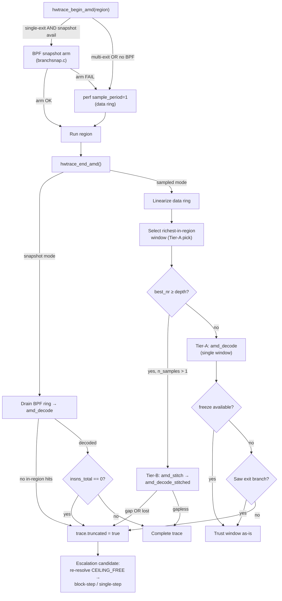

# AMD Tracing – Review & Recommendations

_Revision 2026-07-09. This revision is a full independent re-verification of the
2026-07-08 review: every finding was adversarially checked against the current
code, stale items were struck, and new findings were added. See §5 for the
delta against the prior revision._

## 1. Executive summary

AMD tracing in `asm-test` is a layered branch-reconstruction stack: an AMD LBR-v2 perf backend (`amd_backend.c` + `hwtrace.c`), a deterministic BPF boundary-snapshot tier (`branchsnap.c`), an MSR-direct snapshot (`msr_lbr.c`), a statistical whole-window survey, and single-step / ptrace fallbacks driven by an auto-escalation cascade (`trace_auto.c`). The code is careful and honest about completeness (it consistently flags `truncated` rather than presenting partial-as-complete), and the previously-reported 40/48-byte binding OOB is fixed in every binding. **The single most important structural fact is that the dev/CI host is AMD Zen 2, which has no LBR-v2 (Zen 4+) and no Zen 3 BRS — so every branch-stack path self-skips on the machine that actually runs the tests, and the *real* exact-trace path here is the single-step / ptrace family, escalated through `trace_auto.c`.** This splits the high-leverage work cleanly into two buckets: (a) improvements that help the Zen 2 host *today* — cheaper block-step JIT tracing, escalation-rung observability, an IBS-Op survey fallback, and AMD-tier debug logging that explains the self-skip; and (b) hardening/perf/tests for the LBR-v2 path that only executes live on Zen 4+ deployments (but whose synthetic reconstruction tests DO run on the Zen 2 CI host). The recommendations below are ranked by real impact under that split, and every LBR-v2-only item is labeled as such so effort is not spent enabling an unusable path.

## 2. Prioritized recommendations

| Priority | Recommendation | Category | Host relevance | Effort | Why it matters |
|---|---|---|---|---|---|
| **P0** | Use shipped `blockstep` (PTRACE_SINGLEBLOCK) in JIT/managed-attach lanes instead of per-instruction single-step | Performance | Zen 2 today | Low | ~order-of-magnitude fewer ptrace round-trips on the real Zen 2 exact path; output already proven byte-identical (F18) |
| **P0** | Give the escalation ladder a rung/mechanism discriminator; set `tier`/`fidelity` per rung | Observability | Zen 2 today | Low | Today all 3 rungs report `SINGLESTEP`; a silent drop from in-process → fork-isolated re-run is undetectable (F22/F37/F26) |
| **P0** | Add `struct_size`/version to `asmtest_hwtrace_options_t`; clamp the init copy | Robustness/ABI | Both | Low–Med | The next appended AMD field re-opens the 40/48-style OOB across ~10 hand-mirrored bindings (F27/F36) |
| **P1** | Add IBS-Op fallback to the statistical whole-window survey | Architecture | Zen 2 today | Med–High | The one "portable/out-of-band" survey tier returns EUNAVAIL on the host it runs on; IBS is the only HW branch source here (F6) |
| **P1** | `ASMTEST_AMD_DEBUG`-gated logging across begin/end/probes | Observability | Both | Med | On Zen 2 an operator can't tell "unsupported CPU" from "failed to arm" from "reconstructed wrong"; logging the probes explains the self-skip (F32) |
| **P1** | Fix escalation: don't discard rung-1 partial / don't return OK for an empty trace | Robustness | Zen 2 today | Low | If rungs 2–3 fail at runtime, caller gets `HW_OK` + empty trace, silently losing rung-1's partial (F24) |
| **P1** | Extend `asmtest_disas_probe` to emit is_branch/is_uncond/target; add an offset→decode cache | Performance | Zen 4+ (runs in Zen 2 CI synthetic tests) | Med | Collapses 2–4 Capstone engine opens/insn to 1 across replay + stitch (F1/F2/F31) |
| **P1** | Host-independent unit test for `hwtrace_end_amd` ring parse/selection | Testing | Both | Med–High | The ring framing / richest-window / LOST / fullness logic has zero CI coverage today (F43) |
| **P1** | Bound `nr` (`nr <= 64`/`amd_depth`) in the region branch-stack parse | Robustness | Zen 4+ | Low | Missing the clamp the survey paths already have; large `nr` wraps the size check → OOB read (F5) |
| **P1** | Surface BPF ringbuf drops / set `truncated` when a snapshot hit is dropped | Robustness | Zen 4+ | Med | A hot region (>~334 hits) can silently drop the richest late window with no truncation signal (F13) |
| **P2** | Structured `asmtest_hwtrace_status()` with a new `EPERM` distinct from `EUNAVAIL` | Observability | Both | Med | Permission-vs-hardware is currently recoverable only by string-parsing `skip_reason()` (F29) |
| **P2** | `ring_buffer__consume` instead of `poll(…,200)` in snapshot end() | Performance | Zen 4+ | Low | ~200 ms stall on every no-hit (truncated) region for zero benefit (F15) |
| **P2** | Hoist `ASMTEST_AMD_REDUCED_FILTER`; share the cpuinfo `amd_lbr_v2` probe | Architecture/dedup | Both | Low | Two hand-synced copies each; drift silently breaks the byte-identical-trace invariant (F34/F35/F11) |
| **P2** | `ASMTEST_STEALTH_TIMEOUT` env for the 3 hardcoded `alarm(15)` sites | Robustness | Zen 2 today | Low | 15 s wall-clock cap truncates legitimate long managed-runtime traces; not adjustable without recompiling (F38) |
| **P2** | Short-record guard before reading `nr`; stitch reduced-filter test; `_Static_assert` on `BSNAP_ENTRY_SZ` | Robustness/Testing | Zen 4+ | Low | Defensive hardening + coverage of `amd_span_decodable`'s dropped-jmp follow (F7/F44/F17) |
| **P3** | Missing `asmtest_amd_snapshot_available` prototype in public header | Docs/ABI | Zen 4+ | Low | 5 hand re-declarations drift silently on signature change (F28) |
| **P3** | Probe diagnostics (`snapshot_status`, per-site debug), `perf_paranoid()` accessor, DESIGN.md §12, LBR tuning guide, SCHED_FIFO for MSR window | Observability/Docs | Mixed | Low–Med | Field-diagnosis and design-context polish; mostly Zen 4+/off-host (F4/F33/F30/F39/F45/F47/F9) |

---

## 3. Detailed findings by theme

### Correctness (Zen 4+ path; validate on CI synthetic tests where possible)

- **Bound `nr` in the region branch-stack parse — F5** (`src/hwtrace.c:827-845`). The region drain reads `nr` at 828 and computes the sample-body size with no `nr` clamp, while the two survey drains apply one at 1070/1211. With `sizeof(entry)=24` and `uint64` math, a large `nr` wraps the `off + h->size <= span` check into a false pass and drives the `e[i]` scan (842-845) past the sample body. **Fix:** add `nr <= 64` (or `nr <= (uint64_t)amd_depth`) to the condition at line 829, matching the siblings. Reachability is low (`nr` comes from the kernel), so this is defensive-consistency.

- **Short-SAMPLE OOB read — F7** (`src/hwtrace.c:828, 1066, 1210`). All three drains load the 8-byte `nr` after validating only `off + h->size <= span`; nothing requires `h->size >= sizeof(*h) + 8`. `buf` is malloc'd to exactly `span`, so a tail SAMPLE with `h->size ∈ [sizeof*h, sizeof*h+7]` over-reads up to 7 bytes. **Fix:** require `off + sizeof*h + sizeof(uint64_t) <= span` before each `nr` load. Unreachable with well-formed kernel samples; hardening only.

Note: the "missing store barrier on `data_tail`" concern was explicitly **rejected** — the event is `IOC_DISABLE`d and the mapping `munmap`'d immediately after, so no concurrent kernel writer exists; the `smp_mb` is genuinely unnecessary here.

### Performance

- **Collapse redundant Capstone engine opens in replay + stitch — F1/F2/F31** (`src/amd_backend.c:206-282` replay, `333-377` `amd_span_decodable`). Each helper (`asmtest_disas_probe`, `_is_branch`, `_is_uncond_jump`, `_branch_target`) does its own `cs_open`+`cs_disasm`+`cs_close` (verified in `src/disasm.c:101-119, 234-251, 315-330, 429-466`), so a straight-line insn costs 2 engine opens, a mid-run conditional up to 4, and the stitch walk re-decodes the same block per candidate shift `d`. **Fix:** extend `asmtest_disas_probe` to also return `is_branch`/`is_uncond_jump`/static target from its single `cs_disasm`, and add a small direct-mapped offset→`{length,is_call,is_ret,is_branch,is_uncond,target}` cache shared by `amd_replay` and `amd_span_decodable`. Constant-factor win. **Host note:** `amd_replay`/`amd_stitch` only run live on Zen 4+, but they execute on the Zen 2 CI host through `test_amd_reconstruction`, so correctness and speed here are CI-exercised. (The same helper-chaining pattern exists on the *real* Zen 2 paths at `ss_backend.c:413` and `ptrace_backend.c:1559/1566` — a broadened probe would help the host too, though that is outside these findings' scope.)

- **Stop iterating after the stitch output buffer fills — F3** (`src/amd_backend.c:460-468`, outer loop at 422). The buffer-full branch breaks only the inner append loop; the outer per-window loop keeps running full O(m·L) overlap searches + decode walks that can never emit. **Fix:** break the outer loop (or set a done flag) on the `n>=out_cap` branch. Low value (only after output is already truncated), Zen 4+ only.

- **Non-blocking drain in snapshot end() — F15** (`src/branchsnap.c:228-230`). `ring_buffer__poll(rb, 200)` does a 200 ms `epoll_wait` before draining; on the no-hit (honest-truncation) path nothing ever wakes epoll, so end() stalls the full 200 ms and drains nothing. Records are already synchronously `bpf_ringbuf_submit`ted in the tracee's context during `run_fn`. **Fix:** `ring_buffer__consume(g_bsnap.rb)`. Zen 4+ only.

### Zen 2 host reality — single-step, block-step, IBS

This is where the highest-value *host-today* work is. All three AMD-LBR TUs self-skip on Zen 2 (`amd_branch_probe` → `AMD_NOHW` on EOPNOTSUPP; `branchsnap`/`msr_lbr` gate on `amd_lbr_v2`). The live exact path is the single-step family.

- **Use block-step in the managed-runtime JIT lanes — F18** (`examples/jit_trace.c:346-351`). The foreign-attach tracer captures via `asmtest_ptrace_run_to` + `asmtest_ptrace_trace_attached[_ex]` — per-instruction `PTRACE_SINGLESTEP`, one kernel round-trip per retired instruction. The library already ships `asmtest_ptrace_trace_attached_blockstep` (`src/ptrace_backend.c:1736`, probe at 1524, reconstruct at 1540-1575) which stops once per taken branch and reconstructs a **byte-identical** offset stream (proven by `test_hwtrace.c:3276-3337`), stepping over call-outs at native speed via `classify_region_exit`/`run_until`. It is only called from a synthetic fixture, never from `jit_trace.c`. **Fix:** on the `dh==NULL` (default) lane at line 351, prefer `blockstep` when `asmtest_ptrace_blockstep_available()`, falling back to `trace_attached` — mirroring the fork path in `trace_auto.c:181-183`. **Scope caveat:** block-step has no descent parameter, so it substitutes only on the default lanes, *not* the `*-descend`/`*-descend-all` lanes (which need `trace_attached_ex`). For a branch-light method this is roughly an order-of-magnitude fewer round-trips with zero output change, and keeps the `alarm(10)` watchdog far from firing.

- **Add an IBS-Op fallback to the statistical survey — F6** (`src/hwtrace.c:983-1105` window; begin `1117-1161`, end `1163+`). `asmtest_hwtrace_sample_window_amd` and its begin/end split arm `PERF_COUNT_HW_BRANCH_INSTRUCTIONS` + `PERF_SAMPLE_BRANCH_STACK`; AMD backs branch-stack only via BRS (Zen 3) / LbrExtV2 (Zen 4+), so on Zen 2 `perf_open` returns EOPNOTSUPP and the whole survey bails to `ASMTEST_HW_EUNAVAIL` (1008-1009, 1135-1136). The tier advertised as crash-proof / out-of-band / portable yields nothing on the machine it runs on. **Fix:** when the branch-stack open fails, fall back to IBS-Op (`PERF_TYPE` from `/sys/bus/event_source/devices/ibs_op/type`, `PERF_SAMPLE_RAW`, bucketing the retired-branch target from `IbsOpData`) at `perf_event_paranoid<=2`, restoring a working statistical hot-method survey on Zen 2. This is the *only* legitimate IBS work: IBS is statistical and must never feed the exact `insns[]`/`blocks[]` parity contract — the exact managed-runtime niche is already covered by shipped ptrace code, not IBS. (There is currently zero IBS code in the repo; IBS appears only in planning docs.)

- **Configurable stealth-helper timeout — F38** (`src/stealth_helper.c:86, 137, 184`). The out-of-process exact-parity stepper hardcodes `alarm(15)` at three sites with no env override; a window spanning managed-runtime execution (e.g. debug .NET, tiered compilation off) can exceed 15 s, and for a flat region the ptrace descend watchdog is not armed, so this `alarm` is the sole backstop — its expiry silently truncates. **Fix:** read `ASMTEST_STEALTH_TIMEOUT` once (default 15) and apply at all three sites.

### Robustness & ABI

- **`struct_size`/version on the options struct — F27/F36** (`include/asmtest_hwtrace.h:68-113`; init copy at `src/hwtrace.c:506`). The struct leads with `backend` at offset 0, no size/version field; `asmtest_hwtrace_init` does an unconditional `g_opts = *opts` after only NULL/state checks. The two most recent fields (`lbr_period`, `branch_filter`) are exactly what grew it 40→48 bytes. The current fix lives entirely in ~10 hand-mirrored bindings — nothing structural prevents the next appended AMD knob from re-creating the OOB. **Fix:** add a leading `uint32_t struct_size` (caller sets `sizeof`), have init reject `size==0` and copy `min(opts->struct_size, sizeof g_opts)` zero-filling the rest, plus a `static_assert` pinning layout. Note adding the field is itself a one-time ABI break (shifts `backend` off offset 0), so all bindings update in the same change; it makes *future* additions additive. Cheaper interim: export `size_t asmtest_hwtrace_options_size(void)` for bindings to assert at load.

- **Escalation must not discard the prior partial or return OK for empty — F24** (`src/trace_auto.c:178-210`). Each rung calls `call_auto_reset(trace)` *before* running (182/199), wiping rung-1's truncated partial; on failure a rung sets only `truncated=true` (192-193/206-207). Because `ran` is set by rung 1 (168) and never re-cleared, if rung 1 left a partial and both ptrace rungs then fail at runtime (fork/ptrace blocked by seccomp/`ptrace_scope`, ENOMEM), the function returns `ASMTEST_HW_OK` with `insns_len==0` and `truncated==true`. **Fix:** capture each rung into a scratch trace and commit only on success; at minimum re-clear `ran` in `call_auto_reset` so an all-fail path returns `EUNAVAIL`, not OK-with-empty.

- **Surface BPF ringbuf drops — F13** (`bpf/branchsnap.bpf.c:30-38`; `src/branchsnap.c:230, 239`). Each hit reserves a 776-byte event in a 256 KiB ringbuf (~334 records), drained once in `snapshot_end`. On overflow `bpf_ringbuf_reserve` returns NULL and the hit is dropped silently; `truncated` is set only when `best_inregion==0`. So a run whose *richest* in-region window first occurs on a late hit (data-dependent deeper path) after saturation loses it with no signal. **Fix:** drain during the run, or select best-in-kernel so only one record is ever emitted, or read ringbuf drops and set `truncated` on any drop. Zen 4+ only; narrower than "any region >334 hits" (uniform loops lose nothing).

- **SCHED_FIFO / mlockall for the MSR capture window — F9** (`src/msr_lbr.c:156-160`, pin 118-128). The enable→run→freeze section is preemptible and, driving the LBR MSRs directly, the kernel does not save/restore the 16-entry stack across context switches; affinity prevents migration but not co-scheduling, and `LBR_SELECT=0x1` suppresses only kernel branches. The dominant outcome is eviction of early edges → honest `truncated` (a fidelity/robustness issue, **not** silent corruption — `amd_replay`'s in-region filter drops foreign edges unless one targets `[base,base+len)`). **Fix:** raise SCHED_FIFO for just the enable→freeze section (restore on the out path), optionally `mlockall`, and document co-scheduled userspace / SMT-sibling contamination in the header. Zen 4+ only.

### Observability

- **Escalation-rung discriminator + reason — F22/F37/F26/F25** (`src/trace_auto.c:141-208`). On Zen 2, `asmtest_trace_call_auto` collapses all three rungs to `{tier=HWTRACE, backend=SINGLESTEP, fidelity=NATIVE}`: rung-1's fast backend resolves to SINGLESTEP (170), rungs 2–3 hardcode SINGLESTEP (188, 204), and `tier`/`fidelity` are set once at 142-144 and never updated even on the ptrace-win paths. So a caller cannot distinguish in-process Trap-Flag step, fork-isolated block-step, and fork-isolated per-instruction step, nor detect that/where escalation fired, nor learn the rejection reason (init failure vs unavailable vs truncated — none of the rung-1 negative branches at 155/159/160 leave a signal). On the EUNAVAIL path `used` is left holding the stale default. **Fix:** add a rung/mechanism out-param (`{FAST_HW, BLOCKSTEP, PER_INSN_STEP}` or in-process-vs-fork flag) plus a coarse per-rung status/reason; set `tier`/`fidelity` per winning rung; zero/clear `used` on EUNAVAIL (or document it as OK-only). This is exactly the triage the Zen 2 cascade exists to support.

- **`ASMTEST_AMD_DEBUG`-gated logging — F32** (`src/hwtrace.c:636-935`; `src/amd_backend.c:56-145, 499-502`). Both TUs contain zero `fprintf`/`getenv`/`perror` (grep confirms). Instrument the begin snapshot-vs-sampled decision + filter fallback + ring sizing, the richest-window/lost/throttle selection, the Tier-A/B choice, the stitch gap, and each capability probe result, matching the existing `ASMTEST_CODEIMAGE_DEBUG` convention (`src/codeimage.c:568/641`). On Zen 2 this makes the self-skip diagnosable — logging the probes tells "unsupported CPU" from "failed to arm (missing CAP_PERFMON)."

- **Structured status with an EPERM code — F29** (`include/asmtest_hwtrace.h:51-57`; `src/hwtrace.c:268, 321-336, 363-378`). `asmtest_hwtrace_available()` is 0/1 and the enum has only `EUNAVAIL` (comment bundles PMU/privilege); the internal `amd_branch_probe()` already computes `AMD_NOHW` vs `AMD_NOPERM` (287/290/291) but discards it at the boundary, surviving only as English in `skip_reason()`. **Fix:** add `asmtest_hwtrace_status(backend)` returning OK / EUNAVAIL / a new `EPERM`, keeping `skip_reason()` as the human string. (On Zen 2, AMD_LBR is always NOHW so the perm branch is moot for that backend specifically; the payoff is the perf-permitted/IBS paranoid path and AMD_LBR NOPERM on Zen 4+.)

- **Lower-value diagnostics — F4/F33/F30/F39.** Opaque `0` from the capability probes conflates "unsupported"/"absent"/"probe failed" (`amd_backend.c:56-120`); add an `asmtest_amd_snapshot_status(char*,size_t)` reporting the first unmet gate (this one *does* help on Zen 2 — the user learns it is the missing `amd_lbr_v2` flag, not a fixable kernel gap) and one-line debug logs at each distinct return site. Add `int asmtest_hwtrace_perf_paranoid(void)` so the denial message can print the concrete level ("perf_event_paranoid is 3; set <=2 or grant CAP_PERFMON") — real but modest and mostly off-host (the Zen 2 exact single-step path uses no perf).

### Architecture / dedup

- **Missing public prototype — F28** (`include/asmtest_hwtrace.h`). `asmtest_amd_snapshot_available()` is a shipped symbol with no header prototype (its sibling `asmtest_amd_msr_available` has one at header:538); it is re-declared by hand in `examples/test_hwtrace.c:46`, `examples/test_branchsnap.c:22`, `src/hwtrace.c:159`, `src/branchsnap.c:32`, and DllImported at `bindings/dotnet/hwtrace/HwTrace.cs:459`. **Fix:** add `int asmtest_amd_snapshot_available(void);` next to `asmtest_amd_snapshot_trace` and drop the local re-declarations so the compiler enforces agreement.

- **`ASMTEST_AMD_REDUCED_FILTER` duplicated — F34** (`src/hwtrace.c:595-598` and `src/branchsnap.c:52-55`), byte-identical with "kept in sync" comments. Both the sampled ring and the BPF snapshot rely on it decoding identically through `amd_replay`; drift silently breaks the byte-identical invariant. **Fix:** hoist into a shared `src/amd_internal.h`.

- **`amd_lbr_v2` cpuinfo parse duplicated — F35/F11** (`src/amd_backend.c:86-107` and `src/msr_lbr.c:63-81`), each hand-rolling the same `fopen`/`strncmp("flags")`/`strstr(" amd_lbr_v2")` loop with its own cache. **Fix:** extract a shared `asmtest_amd_has_lbr_v2_flag()` in `amd_backend.c` (the CPUID/depth owner); the snapshot path keeps its extra `perfmon_v2`/kernel gates on top, the MSR path gates on the flag alone. Zen 4+ cleanup (both return 0 on Zen 2).

- **`_Static_assert` on `BSNAP_ENTRY_SZ` — F17** (`bpf/branchsnap_event.h:14`; assert near `src/branchsnap.c:37`). `BSNAP_ENTRY_SZ 24u` is reinterpreted as `struct perf_branch_entry[]` with no compile-time tie, even though `<linux/perf_event.h>` is in scope — and `src/codeimage.c:35` already carries exactly this pattern for another BPF-shared struct. **Fix:** `_Static_assert(sizeof(struct perf_branch_entry) == BSNAP_ENTRY_SZ, ...)`. Low probability (frozen UAPI) but matches the codebase's own convention.

### Testing

- **Host-independent `hwtrace_end_amd` ring-parse test — F43** (`examples/test_hwtrace.c:3056-3110`; logic in `src/hwtrace.c:~731-950`). The ring linearization, `PERF_RECORD_SAMPLE`/`LOST` counting, richest-in-region `best_nr` selection, and the `max_sample` near-full-ring fullness gate are in a static no-seam function with zero host-independent coverage — every test that would reach it self-skips when `ASMTEST_HWTRACE_AMD_LBR` is unavailable (always true on Zen 2), and the exported-primitive tests feed pre-built `perf_branch_entry[]` arrays that never construct a header ring. **Fix:** extract the ring-parse+select logic (or add a test seam) and feed a crafted `{perf_event_header + u64 nr + perf_branch_entry[]}` buffer, asserting richest-window pick, LOST detection, and the Tier-A/B complete-vs-prefix decision — lets Zen 2 CI guard the Zen 4+ path.

- **Stitch-under-reduced-filter test — F44** (`examples/test_hwtrace.c:874-1017`). `amd_span_decodable`'s dropped-uncond-jmp follow (`src/amd_backend.c:352-368`) is a *separate* implementation from `amd_replay`'s follow and has no coverage: the reduced-filter test only exercises `amd_replay`, and the three stitch tests never enter the jmp branch (`AMD_LOOP`'s back-edge is a conditional `jnz`; `test_amd_stitch_period_spaced` passes `base=NULL`, short-circuiting the guard at line 336). **Fix:** add `test_amd_stitch_reduced_filter` with synthetic overlapping windows carrying a dropped uncond jmp at the overlap boundary, asserting `gap==0`. Host-independent (runs on Zen 2 CI).

### Docs

- **DESIGN.md has no hardware-trace section — F45** (`DESIGN.md:280-365`). It documents Phases 0-11 and ends at §8/Sources; the only "tracing" is the emulator's Phase 10 hooks. Nothing describes AMD LBR-v2, MSR-direct, BPF branchsnap, single-step/ptrace, or auto-escalation — and critically nothing states the Zen-2-vs-Zen-4 constraint, risking wasted effort enabling an unusable path. **Fix:** add "§12 Hardware Trace Backends" covering the four backends, Tier-A/B, stitching, and the governing constraint.
- **No AMD LBR tuning guide — F47** (`include/asmtest_hwtrace.h:86-112`). `lbr_period`/`branch_filter` are thoroughly documented inline but there is no published guide; the header even points to the internal plan. **Fix:** add a short "Tuning AMD LBR capture" subsection to the guides site. Low, Zen 4+ only.

---

## 4. AMD capture decision flowchart

---

## 5. Delta vs the 2026-07-08 revision

**Newly found (not in the prior revision):**
- **F18** — the JIT/managed lanes single-step instead of using the shipped byte-identical `blockstep`. This is the single highest-value *Zen 2-today* item and was absent from the prior revision.
- **F5 / F7** — the `nr` bound omission and the short-SAMPLE OOB read in the ring drains (concrete OOB reads, not previously found).
- **F13 / F15** — BPF ringbuf silent overflow and the 200 ms no-hit `poll` stall in `branchsnap.c` (the prior revision did not audit branchsnap at this depth).
- **F6** — the IBS-Op *fallback for the survey* framed as the host-today gap (the prior revision had no IBS content at all).
- **F28 / F17 / F44** — missing public prototype, `BSNAP_ENTRY_SZ` static-assert, and the `amd_span_decodable` dropped-jmp test gap (sharper than the old T2).
- **F22 sharpening** — the old O2 noted "escalation history is not exposed"; verification shows the deeper defect that all three rungs report identical `SINGLESTEP` and `tier`/`fidelity` are never updated per-rung, and F24's OK-for-empty-trace bug is entirely new.

**Confirmed (prior revision was right; kept above):** C1→**F33**, C2→**F42/F9** (contamination is documented; SCHED_FIFO is the residual enhancement), O1→**F32**, O2→**F37**, A1→**F34**, A2→**F35**, R1→**F36/F27**, R2→**F39/F30**, R3→**F38** (broadened: three `alarm(15)` sites, not one), P1→**F31/F1/F2**, T1→**F43**, D1→**F45**, D3→**F47**. Line numbers in the prior revision were largely still accurate.

**Already resolved / struck from this revision:**
- **C4** (addr-channel overflow) — verified fixed: `publish` writes modulo `CAP` and sets `overrun`; was already marked struck. Confirmed no action.
- **T3** (synthetic AMD tests in CI) — **resolved**, but the prior evidence was wrong: coverage rides exactly one lane, the unguarded `hwtrace` job (`ci.yml:304`, runs on every PR, installs libcapstone). `ci.yml:123` is the nightly-gated `test-macos-x86` job where these tests compile to no-ops under `#if defined(__linux__) && defined(__x86_64__)`, and `Makefile:63` is the SUITE_EXCLUDES list (test_hwtrace is *excluded* from `make test`, not included). The no-action conclusion stands on corrected evidence.
- **C3** (near-full-ring over-estimate) — the recommendation (document the conservative full-depth assumption) is already implemented at `hwtrace.c:861-868`; the item is a no-op, closed.
- **D2** (failure-path flowchart) — the Mermaid diagram is retained in §4 of this document; copying it into the internal plan is optional docs-duplication, closed as effectively done.
- **P2** (double-pass ring scan) — the two passes are near-intrinsic (array pre-sizing needs `n_samples` up front) and input is bounded by `dsz`. Kept as "won't fix."

**Considered and rejected during verification (do not act on):** missing `data_tail` store barrier (producer disabled + immediate munmap makes it moot); the MSR "coarse in-region filter" and "unchecked stack-clear writes" contamination claims (defeated by stack-zeroing + valid-bit filtering + the checked config-write canary); snapshot pid=0 cross-thread truncation (the snapshot markers are synchronous same-thread inline; cross-thread runtimes route to ptrace by design); the CASCADE-omits-ptrace-ladder claim (all reported backends are in CASCADE and the ptrace rungs are fork-and-rerun, not foreign-attach); and the "shared 64K cap makes 'no ceiling' misleading" claim ("ceiling" is a term of art for the AMD LBR depth ceiling and the header honestly caveats completeness).

---

## 6. Source references

| File | Role |
|------|------|
| `src/amd_backend.c` | Branch-record decode, Tier-A/B replay, stitching, capability probes |
| `src/hwtrace.c` | AMD perf capture, ring parsing, Tier-A/B decision, freeze gate, statistical survey |
| `src/branchsnap.c` + `bpf/branchsnap.bpf.c` | Deterministic BPF boundary-snapshot capture |
| `src/msr_lbr.c` | MSR-direct LBR snapshot (zero-PMI Tier-A) |
| `src/trace_auto.c` | Cross-tier auto-escalation ladder |
| `src/ptrace_backend.c` | Out-of-process step/block-step tracing (the live Zen 2 exact path) |
| `src/stealth_helper.c` | Out-of-process ptrace stepper |
| `src/disasm.c` | Capstone helpers used by replay/stitch |
| `examples/jit_trace.c` | Managed-runtime JIT tracing lanes |
| `include/asmtest_hwtrace.h` | Public AMD options & API |
| `include/asmtest_trace_auto.h` | Cross-tier auto-escalation API |
| `DESIGN.md` | Project design document (gap: no hardware-trace section) |
| `docs/internal/plans/amd-tracing-plan.md` | AMD design plan, Parts I–III |

*End of review.*
