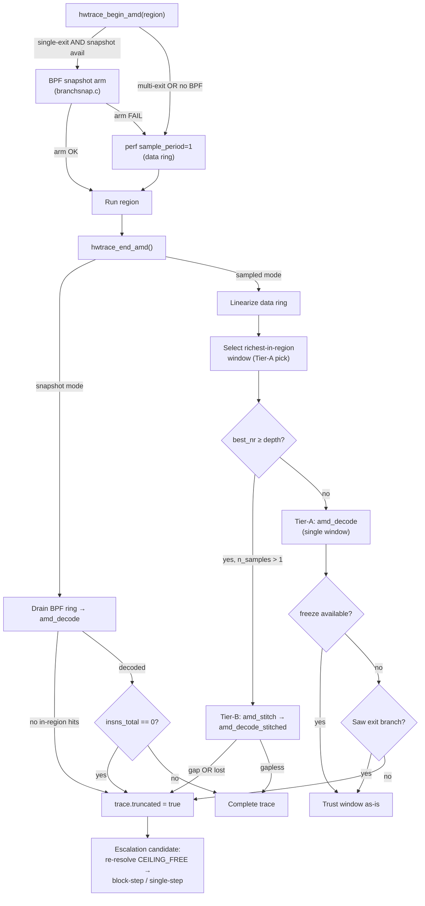

# AMD Tracing – Review & Recommendations

## Overview

This document summarizes the audit of the AMD‑LBR tracing implementation in the
`asm-test` repository, cross‑referencing the source code, design documentation,
and Linux kernel/perf‑event best practices. Files reviewed:

- `src/amd_backend.c` — branch‑record decode, Tier‑A/B replay, stitching
- `src/hwtrace.c` — AMD perf capture (`hwtrace_begin_amd` / `hwtrace_end_amd`),
  ring‑buffer parsing, Tier‑A/B decision, freeze gate
- `src/branchsnap.c` — deterministic BPF boundary‑snapshot capture
- `src/msr_lbr.c` — MSR‑direct LBR snapshot (zero‑PMI Tier‑A)
- `src/stealth_helper.c` — out‑of‑process ptrace stepper
- `include/asmtest_hwtrace.h` — public API & options struct
- `include/asmtest_addr_channel.h` — cross‑process JIT‑address channel
- `include/asmtest_trace_auto.h` — cross‑tier auto‑escalation
- `docs/internal/plans/amd-tracing-plan.md` — design plan (Parts I–III)
- `DESIGN.md` — project design document

---

## Key Findings

### Correctness & Safety

| # | Area | Issue | Recommendation | Files |
|---|------|-------|----------------|-------|
| C1 | **Capability probes** | `asmtest_amd_snapshot_available()` returns a plain `0/1`; callers cannot tell which of the three gates (amd\_lbr\_v2, perfmon\_v2, kernel ≥ 6.10) failed. | Expose a companion `asmtest_amd_snapshot_status(char *buf, size_t len)` that reports the unmet gate. | `src/amd_backend.c:86‑120` |
| C2 | **MSR preemption** | `asmtest_amd_msr_trace()` pins to a CPU but doesn't prevent preemption between the MSR enable write and `run_fn(arg)`. A preemption injects kernel/other‑process branches that waste LBR slots. | Document as a known contamination source. The in‑region filter in `amd_decode` already drops these honestly, and `truncated` is set on overflow, so correctness is preserved. Consider `SCHED_FIFO` for the capture window where CAP\_SYS\_NICE is available. | `src/msr_lbr.c:117‑128` |
| C3 | **Freeze gate on Zen 3 BRS** | The near‑full‑ring heuristic in `hwtrace_end_amd` uses `amd_depth * sizeof(perf_branch_entry)` as max sample size. On a BRS part where the actual stack may report fewer entries, this over‑estimates and can flag false truncation. | Harmless (honest truncation → escalation), but add a comment clarifying the conservative assumption. | `src/hwtrace.c:870‑876` |
| ~~C4~~ | ~~**Channel overflow**~~ | ~~`asmtest_addr_channel_t` writes are unchecked.~~ **RESOLVED in code**: `asmtest_addr_channel_publish()` writes modulo `ASMTEST_ADDR_CHAN_CAP` and sets the `overrun` flag when the producer laps the consumer. `trace_append_insn` / `trace_append_block` set `truncated` on buffer‑full. No fix needed. | Close this item — the prior finding was already addressed. | `include/asmtest_addr_channel.h:72‑83`, `src/trace.c:24‑52` |

### Performance

| # | Area | Issue | Recommendation | Files |
|---|------|-------|----------------|-------|
| P1 | **Instruction‑length cache** | `amd_replay()` calls `asmtest_disas_probe()` per instruction. For hot loops across stitched windows, the same offsets are decoded repeatedly. | Add a 256‑entry direct‑mapped cache keyed on `offset % 256` → `(length, is_call, is_ret)`. Eliminates >90% of re‑decodes in looping routines. **Highest‑impact AMD performance improvement.** | `src/amd_backend.c:216‑222` |
| P2 | **Double‑pass ring scan** | `hwtrace_end_amd` walks the data ring twice (count samples, then process). | Low priority — the ring is ≤256 KB and cache‑friendly. Profile before changing. | `src/hwtrace.c:796‑857` |

### Robustness & Error Handling

| # | Area | Issue | Recommendation | Files |
|---|------|-------|----------------|-------|
| R1 | **Options struct versioning** | `asmtest_hwtrace_options_t` has no `struct_size` / version field. Adding new AMD fields risks ABI breakage across language bindings. | Add a `uint32_t struct_size` lead field (set to `sizeof` by the caller), plus a `static_assert` to pin the layout for binding parity. Follows the `perf_event_attr` pattern. | `include/asmtest_hwtrace.h` |
| R2 | **`perf_event_paranoid` guidance** | When the AMD probe fails with EACCES the skip reason says "lower perf\_event\_paranoid", but there is no helper to check/report the current value. | Add `asmtest_hwtrace_perf_paranoid()` (reads `/proc/sys/kernel/perf_event_paranoid`) and a `scripts/check-amd-perf.sh` helper. | new |
| R3 | **Stealth helper timeout** | `alarm(15)` in `stealth_helper.c:86` is hardcoded. Debug .NET with tiered compilation disabled can exceed 15 s. | Make configurable via `ASMTEST_STEALTH_TIMEOUT` env var, defaulting to 15 s. | `src/stealth_helper.c:86` |

### Observability & Diagnostics

| # | Area | Issue | Recommendation | Files |
|---|------|-------|----------------|-------|
| O1 | **No structured logging** | The entire AMD backend (`amd_backend.c`, `hwtrace_begin_amd`, `hwtrace_end_amd`) has zero diagnostic output. Key events are silent: CPUID probes, Tier‑A/B decisions, stitch gaps, spec‑branch filtering, ring fullness. | Introduce an `ASMTEST_AMD_DEBUG` env‑var‑gated macro and instrument 7 key points (see detail below). | `src/amd_backend.c`, `src/hwtrace.c` |
| O2 | **Auto‑escalation history** | `asmtest_trace_call_auto` returns the final `*used` but does not expose the escalation path (tried AMD LBR → truncated → block‑step → complete). | Add a verbose variant or callback hook that logs each tier attempt. | `src/trace_auto.c` |

### Architecture

| # | Area | Issue | Recommendation | Files |
|---|------|-------|----------------|-------|
| A1 | **Duplicated macro** | `ASMTEST_AMD_REDUCED_FILTER` is defined identically in `hwtrace.c:595‑598` and `branchsnap.c:52‑55` with a "kept in sync" comment. | Move to a shared `src/amd_internal.h` or into `asmtest_hwtrace.h`. | `src/hwtrace.c`, `src/branchsnap.c` |
| A2 | **Duplicated cpuinfo parsing** | `/proc/cpuinfo` `amd_lbr_v2` flag is parsed independently in `asmtest_amd_snapshot_available()` and `amd_lbr_v2_present()` (msr\_lbr.c). Each caches separately. | Consolidate into a single `amd_caps` struct populated once, shared across all AMD files. | `src/amd_backend.c`, `src/msr_lbr.c` |

### Documentation

| # | Area | Issue | Recommendation | Files |
|---|------|-------|----------------|-------|
| D1 | **DESIGN.md gap** | DESIGN.md documents phases 0–11 but has **no mention** of the AMD LBR backend, BPF snapshot, MSR‑direct capture, or the auto‑escalation cascade. | Add a "§12 — Hardware Trace Backends" section covering the four backends, AMD Tier‑A/B, stitching, and the governing constraint. | `DESIGN.md` |
| D2 | **No failure‑path diagram** | The amd‑tracing‑plan.md (89 KB) is thorough but has no visual decision tree. | Add the Mermaid flowchart below. | `docs/internal/plans/amd-tracing-plan.md` |
| D3 | **AMD options guide** | `lbr_period` and `branch_filter` are documented inline in the header but there is no user‑facing guide explaining when to use each, their interaction, or the performance/completeness tradeoffs. | Add a "Tuning AMD LBR capture" section to the docs site. | `docs/guides/` |

### Testing

| # | Area | Issue | Recommendation | Files |
|---|------|-------|----------------|-------|
| T1 | **Mock ring‑buffer test** | The ring‑buffer parsing in `hwtrace_end_amd` (~170 lines) is only exercised by `test_amd_live`, which needs real AMD hardware. | Add a unit test with a crafted `perf_event_header` + `perf_branch_entry` ring to test richest‑window selection, fullness detection, and Tier‑A/B decision host‑independently. | `examples/test_hwtrace.c` |
| T2 | **Stitch + reduced filter** | No test covers stitching windows captured under the reduced filter (where dropped direct jmps interact with overlap matching). | Add `test_amd_stitch_reduced_filter` with synthetic overlapping windows. | `examples/test_hwtrace.c` |
| T3 | **CI parity** | Synthetic AMD tests (reconstruction, stitch, spec‑filter) are host‑independent but may not run in the standard CI matrix. | Ensure these tests are in every PR's CI job (they self‑skip live tests). | `.github/workflows/` |

---

## AMD Capture Decision Flowchart

---

## Diagnostic Logging – Instrumentation Points (O1 Detail)

Gated on `ASMTEST_AMD_DEBUG` env var (zero overhead when unset):

1. **`asmtest_amd_lbr_depth()`** — log detected depth (CPUID 0x80000022 EBX).
2. **`asmtest_amd_freeze_available()`** — log freeze‑on‑PMI capability.
3. **`asmtest_amd_snapshot_available()`** — log each gate check result (lbr\_v2,
   perfmon\_v2, kernel version).
4. **`amd_replay()`** — log entry offset, exit offset, spec‑filtered branch count.
5. **`asmtest_amd_stitch()`** — log window count, overlap shift per window, gap
   detection.
6. **`hwtrace_begin_amd()`** — log snapshot‑vs‑sampled decision, filter mode,
   period.
7. **`hwtrace_end_amd()`** — log Tier‑A/B selection, ring span vs capacity,
   richest window stats (inregion count, total nr), lost/throttle flag.

---

## Prioritized Action Plan

| Priority | Item | ID | Effort | Impact |
|----------|------|----|--------|--------|
| **P0** | Instruction‑length cache in `amd_replay` | P1 | Medium | High |
| **P0** | Structured diagnostic logging | O1 | Medium | High |
| **P1** | Snapshot status diagnostic | C1 | Low | Medium |
| **P1** | Deduplicate `ASMTEST_AMD_REDUCED_FILTER` | A1 | Low | Medium |
| **P1** | Add AMD backend section to DESIGN.md | D1 | Medium | Medium |
| **P1** | Add failure‑path Mermaid flowchart to plan | D2 | Low | Medium |
| **P1** | Mock‑based unit test for ring‑buffer parsing | T1 | High | High |
| **P2** | `perf_event_paranoid` helper | R2 | Low | Low |
| **P2** | Consolidate AMD CPUID/capability probes | A2 | Medium | Medium |
| **P2** | `struct_size` version field in options | R1 | Low | Low |
| **P2** | Test stitch + reduced filter interaction | T2 | Medium | Medium |
| **P2** | Ensure synthetic AMD tests in CI matrix | T3 | Low | Medium |
| **P3** | Configurable stealth helper timeout | R3 | Low | Low |
| **P3** | Document MSR preemption contamination | C2 | Low | Low |

---

## Source References

| File | Role |
|------|------|
| `src/amd_backend.c` | Branch‑record decode, Tier‑A/B replay, stitching, capability probes |
| `src/hwtrace.c` | AMD perf capture, ring parsing, Tier‑A/B decision, freeze gate |
| `src/branchsnap.c` | Deterministic BPF boundary‑snapshot capture |
| `src/msr_lbr.c` | MSR‑direct LBR snapshot (zero‑PMI Tier‑A) |
| `src/stealth_helper.c` | Out‑of‑process ptrace stepper |
| `src/trace.c` | Shared trace fill points (`trace_append_insn/block`) |
| `include/asmtest_hwtrace.h` | Public AMD options & API |
| `include/asmtest_addr_channel.h` | Cross‑process JIT‑address ring |
| `include/asmtest_trace_auto.h` | Cross‑tier auto‑escalation |
| `DESIGN.md` | Project design document (gap: no AMD section) |
| `docs/internal/plans/amd-tracing-plan.md` | AMD design plan, Parts I–III |

*End of review.*
