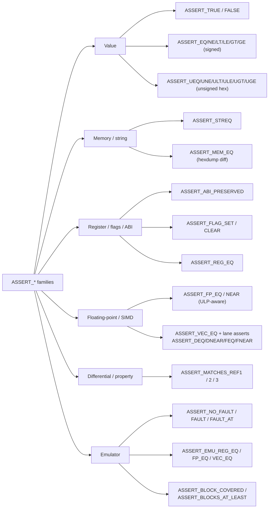

# Assertions

Assertions are macros from `asmtest.h`. On failure they capture the file, line,
expression, and the actual-vs-expected values, then `longjmp` back into the
runner — failing **only the current test** and continuing the suite. This page
covers the value, string, and memory assertions; register, flag, floating-point,
and SIMD assertions have their own pages.

The full assertion surface spans six families — this page is the first two; the
rest are linked under [Related assertion families](#related-assertion-families):



## Boolean

| Macro | Passes when |
|---|---|
| `ASSERT_TRUE(x)` | `x` is nonzero |
| `ASSERT_FALSE(x)` | `x` is zero |

## Signed integer comparison

Operands are compared and reported as signed 64-bit integers.

| Macro | Passes when |
|---|---|
| `ASSERT_EQ(a, b)` | `a == b` |
| `ASSERT_NE(a, b)` | `a != b` |
| `ASSERT_LT(a, b)` | `a < b` |
| `ASSERT_LE(a, b)` | `a <= b` |
| `ASSERT_GT(a, b)` | `a > b` |
| `ASSERT_GE(a, b)` | `a >= b` |

```c
TEST(arith, signed_compare) {
    ASSERT_EQ(add_signed(2, 3), 5);
    ASSERT_LT(add_signed(-4, 1), 0);
}
```

## Unsigned integer comparison

The same set, but compared **and reported as unsigned hex** — the right choice
for addresses, register values, and bit patterns where a signed view would
mislead.

| Macro | Passes when |
|---|---|
| `ASSERT_UEQ(a, b)` | `a == b` (unsigned) |
| `ASSERT_UNE(a, b)` | `a != b` |
| `ASSERT_ULT(a, b)` | `a < b` |
| `ASSERT_ULE(a, b)` | `a <= b` |
| `ASSERT_UGT(a, b)` | `a > b` |
| `ASSERT_UGE(a, b)` | `a >= b` |

```c
TEST(ptr, high_bit_set) {
    ASSERT_UGE(some_address, 0x8000000000000000UL);
}
```

## Strings

`ASSERT_STREQ(a, b)` compares two NUL-terminated strings with `strcmp` and prints
both on mismatch.

```c
ASSERT_STREQ(to_upper("abc"), "ABC");
```

## Memory

`ASSERT_MEM_EQ(ptr, expect, len)` compares `len` bytes. On failure it reports the
**first differing byte** and a hexdump window of expected vs actual, so a wrong
byte deep in a buffer is easy to spot.

```c
TEST(mem, fills_buffer) {
    unsigned char buf[8];
    fill_bytes(buf, 0xAB, sizeof buf);
    unsigned char want[8] = {0xAB,0xAB,0xAB,0xAB,0xAB,0xAB,0xAB,0xAB};
    ASSERT_MEM_EQ(buf, want, sizeof buf);
}
```

For routines that write through pointers, pair this with the
[guard-page buffers](runner.md#guard-page-buffers) so an out-of-bounds write
faults precisely instead of silently corrupting the heap.

## Related assertion families

| Family | Page |
|---|---|
| `ASSERT_ABI_PRESERVED`, `ASSERT_FLAG_SET/CLEAR`, `ASSERT_REG_EQ` | [ABI capture & registers](abi-capture.md) |
| `ASSERT_FP_EQ/NEAR`, `ASSERT_VEC_EQ`, lane asserts | [Floating-point & SIMD](floating-point-simd.md) |
| `ASSERT_MATCHES_REF{1,2,3}` | [Property testing](property-testing.md) |
| `ASSERT_NO_FAULT`, `ASSERT_EMU_*`, `ASSERT_BLOCK_COVERED` | [Emulator tier](emulator.md) |

A consolidated list of every macro is in the [API reference](api-reference.md).
