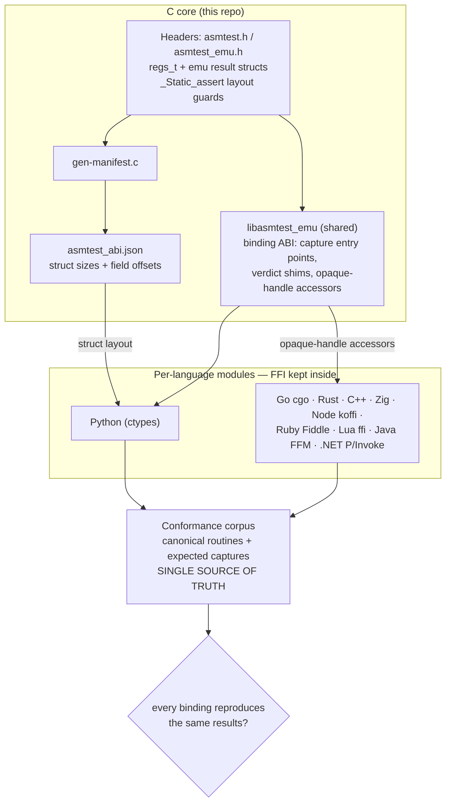

# Language bindings

asm-test ships bindings for ten languages so you can drive the framework from
your own test suite. Every binding exposes the same three capabilities:

* the **capture trampoline** — run a routine through the real ABI and snapshot
  registers, flags, and the FP/vector return lanes;
* the **emulator** — run it in a virtual CPU, where faults are *data*, not a
  crash; and
* an optional **in-line assembler** (Keystone) — pass a routine as assembly
  *text* instead of a compiled address, then either run it in the emulator or
  just assemble it to machine-code bytes (multi-arch).

This page is the **shared overview** — architecture, one-time setup, and the
capability map common to every binding. Each language then has its own page with
an end-to-end, idiomatic example:

| Language | Page | FFI mechanism |
|---|---|---|
| Python | [Python binding](bindings/python.md) | `ctypes` |
| .NET | [.NET binding](bindings/dotnet.md) | P/Invoke |
| Go | [Go binding](bindings/go.md) | `cgo` |
| Rust | [Rust binding](bindings/rust.md) | `extern` + build script |
| C++ | [C++ binding](bindings/cpp.md) | direct `#include` |
| Zig | [Zig binding](bindings/zig.md) | `@cImport` |
| Node.js | [Node.js binding](bindings/node.md) | `koffi` |
| Java | [Java binding](bindings/java.md) | FFM (Panama) |
| Ruby | [Ruby binding](bindings/ruby.md) | `Fiddle` |
| Lua | [Lua binding](bindings/lua.md) | LuaJIT `ffi` |

**Python** is the reference binding (start there if you're new); **.NET** and
**Go** are the other two with worked, all-three-capability examples. For how each
package is assembled and published, see [Packaging the bindings](packaging.md).

Every binding loads the shared library built from this repo and calls the
**binding ABI** — the macro-free entry points catalogued in the
[API reference](api-reference.md). The Python binding reads struct layout from
the `asmtest_abi.json` manifest; the rest go through the opaque-handle accessors
(`asmtest_regs_*`, `asmtest_emu_*`), so no `regs_t` layout is mirrored on their
side.

The whole substrate hangs off one flat C-ABI surface, kept honest by the layout
manifest and a shared conformance corpus — the single source of truth every
binding must reproduce:



## One-time setup

From the repository root, build the native library the bindings load:

```sh
make shared-emu    # libasmtest_emu.{so,dylib} — capture trampoline + emulator + FFI accessors
make manifest      # asmtest_abi.json — required by the Python binding only
```

The in-line assembler is an *optional* add-on, built into a separate library so
the base build needs no Keystone dependency:

```sh
make shared-emu-asm  # libasmtest_emu_asm.{so,dylib} — the above plus the Keystone assembler
```

Your *routine under test* is any System V ABI function in a shared library.
Assemble yours with the
[`asm.h`](https://github.com/wilvk/asm-test/blob/main/include/asm.h) shim into
one:

```sh
cc -shared -fPIC -Iinclude -o libmyroutines.so myroutines.s
```

At run time the dynamic loader must find `libasmtest_emu` — point it at the
build directory with `LD_LIBRARY_PATH` (Linux) or `DYLD_LIBRARY_PATH` (macOS), or
set `ASMTEST_LIB` for Python. The emulator tier additionally needs **libunicorn**
(see [Emulator tier](emulator.md)).

To use the in-line assembler, point the binding at `libasmtest_emu_asm` instead
(which also needs **libkeystone**). The `make <lang>-asm-test` targets do this
for you — e.g. `make python-asm-test`, `make dotnet-asm-test`, `make go-asm-test`
build the assembler lib and set `ASMTEST_LIB` accordingly. Because it is
optional, the dynamic-FFI bindings have a runtime `asm_available()` /
`AsmAvailable` probe: against the plain `libasmtest_emu` it returns false and the
assembler calls self-skip. The statically compiled bindings (C++ and Zig) gate
the assembler at **build time** instead — `-DASMTEST_ENABLE_ASM` for C++,
`-Dasm=true` for Zig — so it compiles out entirely against a Keystone-free build.

## Capabilities at a glance

Every binding exposes the same surface. Here each capability is mapped to the
three featured bindings' idiom; the other seven mirror these (see each language's
page, linked above).

| Capability | Python | .NET | Go |
|---|---|---|---|
| Resolve a built-in corpus routine | load your own lib (`ctypes.CDLL`) | `Corpus.Routine("name")` | `asmtest.CorpusRoutine("name")` |
| Integer capture (≤6 args) | `capture(fn, *args)` | `r.Capture6(fn, …)` | `r.Capture6(fn, …)` |
| Float/double capture | `capture_fp(fn, fargs=…)` | `r.CaptureFp2(fn, a, b)` | `r.CaptureFP2(fn, a, b)` |
| Vector / SIMD capture | `capture_vec(fn, vargs=…)` | `r.CaptureVecF32(fn, vecs)` | `r.CaptureVecF32(fn, vecs)` |
| Integer return value | `r.ret` | `r.Ret` | `r.Ret()` |
| FP return value | `r.fret` | `r.FRet` | `r.FRet()` |
| Vector return lanes | `r.vec_f32(i)` / `r.vec_f64(i)` | `r.VecF32(i)` | `r.VecF32(i)` |
| Condition flag (CF/ZF/…) | `r.flag_set("CF")` | `r.FlagSet("CF")` | `r.FlagSet("CF")` |
| ABI (callee-saved) preserved | `r.abi_preserved` | `r.AbiPreserved` | `r.ABIPreserved()` |
| Run under the emulator | `e.call(fn, [args])` | `e.Call2(fn, a, b)` | `e.Call2(fn, a, b, res)` |
| Fault is data, not a crash | `res.faulted` | `res.Faulted` | `res.Faulted()` |
| Where/why a fault hit | `res.fault_addr` / `res.fault_kind` | `res.FaultAddr` / `res.FaultKind` | `res.FaultAddr()` / `res.FaultKind()` |
| Read a guest register (GP + `rip`/`rflags`) | `res.reg("rax")` | `res.Reg("rax")` | `res.X86Reg("rax")` |
| Read a guest XMM lane | `res.xmm_f64(0, 0)` | `res.XmmF64(0, 0)` | `res.XmmF64(0, 0)` |
| Emulate raw bytes (≤6 int args) | `e.call(code, args)` | `e.CallBytes(code, args)` | `e.CallBytes(code, args, res)` |
| Emulate with FP / vector args | `e.call_fp(code, fargs=…)` | `e.CallFp(code, …)` | `e.CallFP(code, …, res)` |
| Win64 calling convention | `e.call_win64(code, args)` | `e.CallWin64(code, args)` | `e.CallWin64(code, args, res)` |
| Cross-arch guest (arm64/riscv/arm) | `GuestEmulator("arm64").call(code, args)` | `new Guest(GuestArch.Arm64).Call(code, args)` | `NewGuest("arm64").Call(code, args, res)` |
| Read a cross-arch guest register | `res.reg("x0")` | `res.Reg("x0")` | `res.Reg("x0")` |
| Execution trace / block coverage | `e.call_traced(code, [], trace)` → `trace.covered(off)` | `e.CallTraced(code, [], trace)` → `trace.Covered(off)` | `e.CallTraced(…, trace, res)` → `trace.Covered(off)` |
| Memory-write watchpoint (Track F) | `w = e.watch_writes(addr, n, EMU_WATCH_ONLY)` → `w.violated` | `e.WatchWrites(addr, n, 1)` → `w.Violated` | `e.WatchWrites(addr, n, "only")` → `w.Violated()` |
| Register invariant (Track F) | `g = e.guard_reg("rbx", 0)` → `g.violated` | `e.GuardReg("rbx", 0)` → `g.Violated` | `e.GuardReg("rbx", 0)` → `g.Violated()` |
| Coverage-guided fuzzing (Track E) | `e.fuzz_cover(code, lo, hi, n)` | `e.FuzzCover(code, lo, hi, n)` | `e.FuzzCover(code, lo, hi, n)` |
| Mutation testing (Track E) | `e.mutation_test(code, inputs)` | `e.MutationTest(code, inputs)` | `e.MutationTest(code, inputs)` |
| AVX2 256-bit capture (Track D) | `capture_vec256(fn, vargs)` (gate `cpu_has_avx2()`) | `Avx.CaptureVec256(fn, vargs)` | `CaptureVec256(fn, vargs)` |
| In-line assembler present? | `asmtest.asm_available()` | `Emu.AsmAvailable` | `asmtest.AsmAvailable()` |
| Run assembly *text* | `e.call_asm(src, [args])` | `e.CallAsm(src, args)` | `e.CallAsm(src, args, …, res)` |
| Assemble text → bytes (multi-arch) | `asmtest.assemble(src, Arch.ARM64)` | `Emu.Assemble(src, AsmArch.Arm64)` | `asmtest.Assemble(src, ArchArm64, …)` |

Every binding also ships **Tier-2 assertions** over these results — `assert_ret`,
`assert_abi_preserved`, `assert_flag`, `assert_fp`, `assert_vec_f32`,
`assert_no_fault`, `assert_fault`, `assert_reg`, and friends (`Asm.Assert.*` in
.NET, `asmtest.Assert*` in Go). Each language's page puts every capability to work
end-to-end.

## Every binding has a reusable module

All ten bindings expose a **reusable library module** that keeps the FFI inside
and presents an idiomatic surface — capture/emulator handles, the optional in-line
assembler, plus Tier-2 assertions — with a thin conformance runner consuming it
(the same corpus, in each language). So none of them require FFI declarations in
your own test code:

| Language | Module | FFI mechanism | Consumer |
|---|---|---|---|
| Python | `asmtest/` package | `ctypes` | `pytest` suite |
| Go | `asmtest.go` | `cgo` | `conformance_test.go` |
| Rust | `src/` crate | `extern` + build script | `tests/` |
| C++ | `asmtest.hpp` | direct `#include` | `test_cpp.cpp` |
| Zig | `src/` module | `@cImport` | build step |
| Node | `asmtest.js` | `koffi` | `conformance.js` |
| Ruby | `asmtest.rb` | `Fiddle` | `conformance.rb` |
| Lua | `asmtest.lua` | LuaJIT `ffi` | `conformance.lua` |
| Java | `Asmtest.java` | FFM (Panama) | `Conformance.java` |
| .NET | `Asmtest.cs` | P/Invoke | `Program.cs` |

Every module deliberately avoids mirroring `regs_t`: Python reads field offsets
from the layout manifest, and the rest call the opaque-handle accessors. That
binding-ABI surface — the array-form capture entry points, the verdict shims, and
the opaque-handle accessors — is catalogued in the
[API reference](api-reference.md).

## Maturity

**Python** is the reference binding: packaged (`pyproject.toml` / wheel), `pytest`
fixtures, and both tiers — the most turnkey today. The others ship the same
reusable module and Tier-2 assertions but are **not yet published packages** with
per-platform native libraries bundled; that staging is tracked in
[Packaging the bindings](packaging.md). Today you consume them as shown on each
language's page (referencing the module and pointing at the built shared libs) —
exactly how the repo wires `make <lang>-test`.

```{toctree}
:maxdepth: 1
:hidden:

bindings/python
bindings/dotnet
bindings/go
bindings/rust
bindings/cpp
bindings/zig
bindings/node
bindings/java
bindings/ruby
bindings/lua
```
