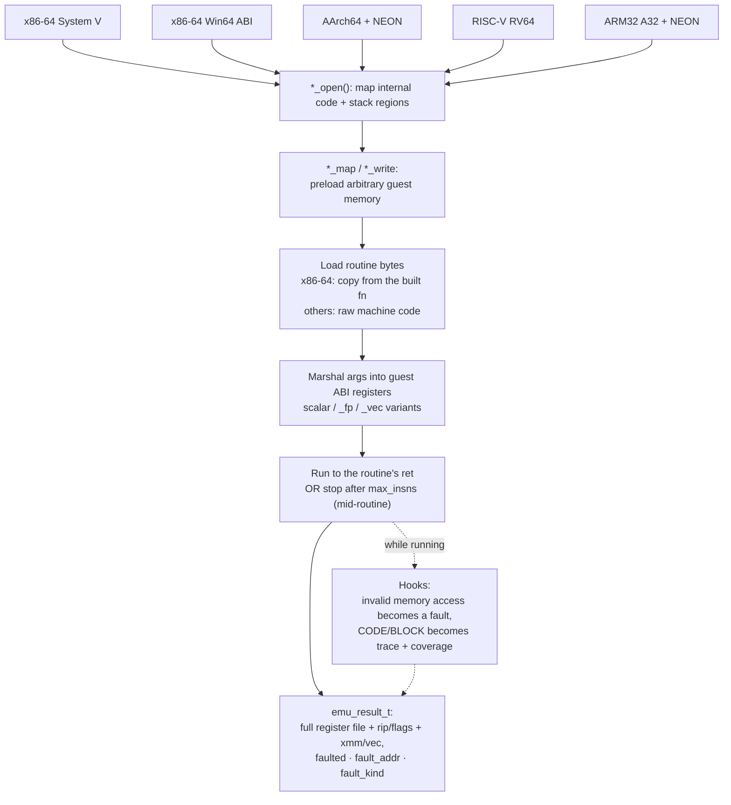
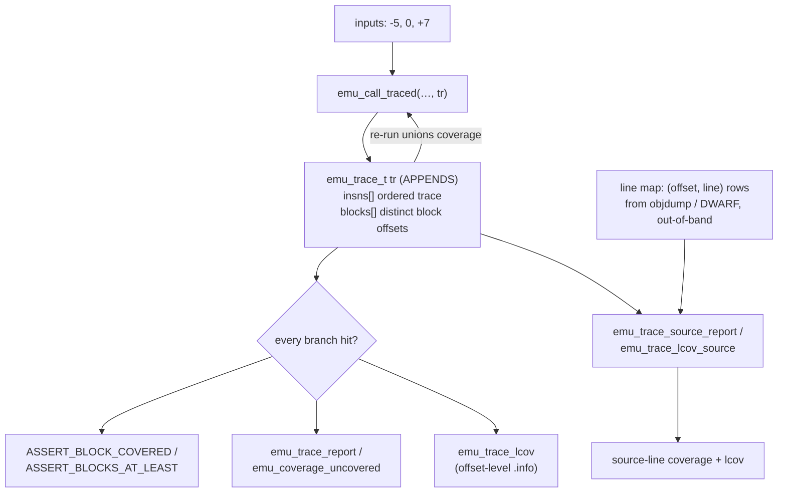

# Emulator tier (optional)

ABI-boundary capture sees the registers *after* a routine returns. The emulator
tier runs a routine inside a virtual CPU ([Unicorn Engine]) so you can do what a
real call cannot: preload arbitrary registers and memory, single-step to a point
*mid-routine*, read back the **full** register file, catch invalid memory
accesses as **precise faults**, and measure **basic-block coverage**.

Because the guest CPU is independent of the host, the AArch64, RISC-V, and ARM32
guests emulate even on an x86-64 host.

All five guests share one shape — `*_open` → `*_map`/`*_write` → `*_call` → a
result struct — over a single Unicorn engine:



## Building and running

The tier needs **libunicorn** and is compiled with `-lunicorn`. Install it and
run the emulator suites:

```sh
make deps DEPS_ARGS=--emu     # install libunicorn (and only that)
make emu-test                 # build and run the emulator suites
```

In a test, include the extra header alongside the main one:

```c
#include "asmtest.h"
#include "asmtest_emu.h"
```

## The x86-64 guest

The x86-64 path copies bytes from a built routine into the guest and runs them:

```c
extern long add_signed(long a, long b);

#define CODE_WINDOW 64   /* >= the routine's byte length; emulation stops at ret */

static emu_t *E;
SETUP(emu)    { E = emu_open(); }
TEARDOWN(emu) { emu_close(E); E = NULL; }

TEST(emu, runs_routine_in_isolation) {
    emu_result_t r;
    long args[] = {20, 22};
    ASSERT_TRUE(emu_call(E, (void *)add_signed, CODE_WINDOW, args, 2, 0, &r));
    ASSERT_EMU_REG_EQ(&r, rax, 42);
}
```

`emu_call(e, fn, code_len, args, nargs, max_insns, &out)` runs `fn` with System V
integer arguments and fills an `emu_result_t`. `code_len` only needs to be **at
least** the routine's length — emulation stops at the routine's own `ret`. Pass
`max_insns > 0` to stop after that many instructions instead, for mid-routine
inspection.

### Reading the result

```c
typedef struct {
    bool ok;                  // ran to ret (or hit the step limit) cleanly
    int uc_err;               // raw Unicorn error code (0 == OK)
    bool faulted;             // an invalid memory access occurred
    uint64_t fault_addr;      // faulting guest address
    emu_fault_kind_t fault_kind;  // READ / WRITE / FETCH / NONE
    emu_x86_regs_t regs;      // full GP file + rip/rflags + xmm[16]
} emu_result_t;
```

The full register file means you can see what a routine left in a register
*mid-flight* — including a callee-saved register it clobbered and restored, which
an ABI-boundary check can never observe:

```c
TEST(emu, reveals_clobbered_callee_saved) {
    emu_result_t r;
    long args[] = {3, 4};
    emu_call(E, (void *)clobbers_rbx, CODE_WINDOW, args, 2, 0, &r);
    ASSERT_EQ(r.regs.rax, 7);
    ASSERT_EQ(r.regs.rbx, 7);   // the value left in rbx mid-routine
}
```

### Preloading memory

Map a guest region, write to it, run a routine that reads it, and read the result
back:

Use an address distinct from the internal code/stack regions — `0x100000` is
`EMU_CODE_BASE` (the routine's own bytes), so map somewhere clear like `0x300000`:

```c
emu_map(E, 0x300000, 0x1000);
emu_write(E, 0x300000, &value, sizeof value);
/* call a routine that loads from 0x300000 … */
emu_read(E, 0x300000, &out, sizeof out);
```

### Faults

An invalid access sets `faulted`, `fault_addr`, and `fault_kind` instead of
crashing the harness:

```c
ASSERT_NO_FAULT(&r);                                  // expect a clean run
ASSERT_FAULT(&r);                                     // expect *some* fault
ASSERT_FAULT_AT(&r, EMU_FAULT_WRITE, 0xdead0000);     // a specific fault
```

With [Capstone](#disassembly-in-diagnostics-capstone) linked, `emu_fault_describe`
turns the fault into a line that names the offending instruction, not just the
address.

### Floating-point and vectors

`emu_call_fp` marshals `double` args into `xmm0`–`xmm7`; `emu_call_vec` marshals
128-bit vectors. Both capture the whole XMM file (`r.regs.xmm[]`):

```c
ASSERT_EMU_FP_EQ(&r, 3.75);          // r.regs.xmm[0].f64[0]
ASSERT_EMU_VEC_EQ(&r, 0, &want);     // a full 128-bit lane
```

## Other guests

All guests share the same shape (`*_open`, `*_map`, `*_write`, `*_read`,
`*_call`, `*_call_traced`) and the same fault, trace, and coverage hooks. The
cross-architecture guests take **raw machine code** (you can't copy bytes from a
host-native routine of a different ISA).

| Guest | Open | Args in | Return | Notes |
|---|---|---|---|---|
| **x86-64** (System V) | `emu_open` | `rdi, rsi, rdx, rcx, r8, r9` | `rax` | copies bytes from a built routine |
| **AArch64** | `emu_arm64_open` | `x0`–`x7` | `x0` | NEON `v[]`; `emu_arm64_call_fp/_vec` |
| **RISC-V (RV64)** | `emu_riscv_open` | `a0`–`a7` | `a0` | no flags register; scalar FP (`f[]`); no vector path (Unicorn exposes no RVV registers) |
| **ARM32 (A32)** | `emu_arm_open` | `r0`–`r3` (AAPCS) | `r0` | full `r0`–`r15` + `cpsr`; NEON `q[]`; `emu_arm_call_fp/_vec` |
| **Windows x64** | (x86-64 engine) | `rcx, rdx, r8, r9` | `rax` | `emu_call_win64`; 32-byte shadow space, `rsi`/`rdi` nonvolatile |

### Windows x64 on a System V host

Win64 rides the existing x86-64 engine rather than needing a Windows host. The
contrast is instructive — identical bytes (`mov rax, rcx`) yield different results
under the two conventions, because Win64 puts the first integer argument in `rcx`
while System V puts it in `rdi`:

```c
long args[] = {111, 222};
emu_call_win64(E, (void *)mov_rax_rcx, CODE_WINDOW, args, 2, 0, &r);
ASSERT_EMU_REG_EQ(&r, rax, 111);   // Win64: first arg in rcx
```

## Coverage & tracing

The `_traced` variants take an opt-in `emu_trace_t` and record, into
caller-owned buffers, an **instruction trace** (each executed instruction's byte
offset from the routine entry, in order) and **basic-block coverage** (the
*distinct* block-start offsets). Either buffer may be `NULL` to skip that
dimension. For the focused guide to trace buffers, coverage comparison,
source-line maps, and lcov export, see [Execution traces and coverage](traces.md).

```c
uint64_t blocks[64];
emu_trace_t tr = {0};
tr.blocks = blocks;
tr.blocks_cap = 64;

long inputs[] = {-5, 0, +7};         // three branch paths in `classify`
for (int i = 0; i < 3; i++) {
    emu_result_t r;
    long a[] = { inputs[i] };
    emu_call_traced(E, (void *)classify, CODE_WINDOW, a, 1, 0, &r, &tr);
}
ASSERT_BLOCKS_AT_LEAST(&tr, 3);      // the union covered all three paths
```

Tracing **appends**, so re-running with the same struct unions coverage across
inputs — that's how you answer *"did the tests exercise every branch?"*:



Key fields:

| Field | Meaning |
|---|---|
| `insns` / `insns_len` / `insns_total` | ordered trace buffer; entries written; total executed (counts past the cap) |
| `blocks` / `blocks_len` / `blocks_total` | distinct block buffer; distinct count; total entries (a loop re-counts each pass) |
| `truncated` | a buffer filled and at least one entry was dropped |

### Reporting

| Function | Purpose |
|---|---|
| `emu_trace_report(&tr, out)` | human-readable trace/coverage summary |
| `emu_coverage_uncovered(covered, universe, …)` | blocks a run missed vs. a universe trace |
| `emu_trace_lcov(&tr, name, out)` | offset-level lcov export |
| `emu_trace_covered(&tr, off)` | predicate: was an offset's block entered? |

Coverage assertions:

```c
ASSERT_BLOCK_COVERED(&tr, 0x12);     // a specific block offset was entered
ASSERT_BLOCKS_AT_LEAST(&tr, 3);      // at least N distinct blocks
```

### Source-line coverage

Block offsets become **source lines** with a caller-supplied line map — an
ascending `(offset, line)` table, the shape of a DWARF line program or an
assembler listing, produced out-of-band (so the framework keeps its
no-DWARF-parsing, no-extra-dependency stance and just consumes the normalized
map). Row *i* spans `[offset_i, offset_{i+1})`; a line is covered when a covered
block begins in its range.

```c
static const emu_line_entry_t rows[] = {{0, 10}, {4, 11}, {8, 12}};
emu_line_map_t map = {rows, 3};

emu_trace_source_report(&covered, &map, stdout);          // "2/3 lines covered" + missed lines
emu_trace_lcov_source(&covered, &map, "classify.s", out); // DA:line,1 for hit, DA:line,0 for missed
```

| Function | Purpose |
|---|---|
| `emu_line_lookup(&map, off)` | the line-map row whose range contains an offset |
| `emu_trace_source_report(covered, &map, out)` | "L/M source lines covered" + uncovered line numbers |
| `emu_trace_lcov_source(covered, &map, file, out)` | line-level lcov export (shows hit **and** missed lines) |

### Disassembly in diagnostics (Capstone)

Faults, traces, and coverage are recorded as **byte offsets** from the routine
entry. When the build links Capstone, helpers such as `emu_disas`,
`emu_fault_describe`, and `emu_trace_report_disasm` annotate those offsets with
the instruction text. The disassembler is optional and self-skipping, so the same
calls degrade to offset-only output when Capstone is absent.

See [Disassembly](disassembly.md) for the build steps, examples, and API
reference.

## Mid-execution guards

Assert properties **while** a routine runs, not just on its result — the
introspection no ABI-boundary tool can do. A guard is armed on the handle and
persists across `emu_call_*` until cleared (so it can span a sweep of inputs);
each run resets the result, then records the **first** violation as data instead
of crashing the host. x86-64 guest.

**Memory-write watchpoints** catch a *logical* scribble that does **not** fault —
a write to mapped memory the routine had no business touching (where a guard page
would see nothing). `EMU_WATCH_ONLY` confines writes to a region; `EMU_WATCH_NEVER`
forbids a region:

```c
emu_map(e, 0x400000, 0x1000);
emu_watch_t w;
emu_watch_writes(e, 0x400000, 8, EMU_WATCH_ONLY, &w);  // must only write [base, base+8)
emu_call(e, fn, len, args, 1, 0, &r);
emu_watch_clear(e);
ASSERT_NO_WRITE_VIOLATION(&w);                         // or ASSERT_WRITE_VIOLATION(&w)

char buf[160];                                          // pairs with the disassembly tier:
emu_watch_describe(&w, EMU_ARCH_X86_64, fn, len, EMU_CODE_BASE, buf, sizeof buf);
//   "write to 0x400800 (8 bytes): mov qword ptr [rdi + 0x800], rax  (@0x3)"
```

**Register invariants** assert a register holds a value at every basic-block
entry — a callee-saved or stack-pointer guard that catches mid-routine corruption
**even when the value is restored by return** (which ABI capture cannot see):

```c
emu_reg_guard_t g;
emu_guard_reg(e, "rbx", 0, &g);   // rbx must stay 0 at every block entry
emu_call(e, fn, len, args, 0, 0, &r);
emu_guard_reg_clear(e);
ASSERT_REG_INVARIANT(&g);         // names the value seen + the block offset on breach
```

| Function | Purpose |
|---|---|
| `emu_watch_writes(e, addr, size, mode, &w)` / `emu_watch_clear(e)` | arm/disarm a write watchpoint |
| `emu_guard_reg(e, "rbx", want, &g)` / `emu_guard_reg_clear(e)` | arm/disarm a block-entry register invariant |
| `emu_watch_describe(&w, arch, code, len, base, buf, n)` | a violation line with the offending store disassembled |
| `ASSERT_NO_WRITE_VIOLATION` / `ASSERT_WRITE_VIOLATION` / `ASSERT_REG_INVARIANT` | the matching assertions |

> The engine **retains register state across calls** on a handle (only the
> argument registers and `rsp` are reset each call), so a register invariant sees
> whatever a previous call left behind — arm it on a fresh `emu_open` handle, or
> account for the carried-over value.

**Step-bounded assertions** need no new API: run with `max_insns=N` (the
single-step path) to stop after N instructions, then inspect `out->regs` with
`ASSERT_EMU_REG_EQ` — a condition asserted at instruction N.

## Coverage-guided fuzzing & mutation testing

The emulator records the exact signal a coverage-guided fuzzer consumes
(basic-block coverage) and can run *mutated* routines safely contained. Two
helpers close those loops for a one-int-arg routine; both are seedable (so runs
reproduce) and run everything inside the emulator, so a pathological input or a
broken mutant cannot crash the host.

**Coverage-guided generation** keeps inputs that grow the block-coverage union,
drawing new candidates fresh *or by mutating a corpus member* (the feedback) — so
it reaches blocks a handful of fixed vectors miss:

```c
uint64_t blocks[16];
emu_trace_t uni = {0};
uni.blocks = blocks; uni.blocks_cap = 16;     // accumulates across the search
emu_fuzz_stat_t st;
emu_fuzz_cover1(e, code, len, -50, 50, /*iters*/2000, /*seed*/0xC0FFEE, &uni, &st);
// classify(x): a fixed vector {5} reaches 3 blocks; the guided search reaches 5
// (it finds the negative path), with a 3-input corpus.
```

**Mutation testing** flips bits of the routine, runs each mutant and the original
on an input set, and counts mutants the set fails to distinguish — *surviving
mutants are a test-gap signal*, and a stronger input set kills more:

```c
emu_mutation_stat_t s;
long weak[]   = {5};                 // only the positive path
long strong[] = {-7, 0, 9};          // all three paths
emu_mutation_test1(e, code, len, weak,   1, /*all bits*/0, 0xABCD, &s); // 100 survive / 92 killed
emu_mutation_test1(e, code, len, strong, 3, 0,            0xABCD, &s); //  16 survive / 176 killed
// the weak suite lets 100 of 192 mutants slip; the strong suite leaves only the
// ~16 equivalent mutants (bit-flips that change no observable behavior).
```

| Function | Purpose |
|---|---|
| `emu_fuzz_cover1(e, code, len, lo, hi, iters, seed, &uni, &stat)` | coverage-guided input search; `stat.blocks_reached` / `corpus_len` |
| `emu_mutation_test1(e, code, len, inputs, n, max_mutants, seed, &stat)` | mutation test; returns survivor count, fills killed/survived |

The original routine is the oracle (its result must be a function of its
argument); `max_mutants = 0` runs every single-bit flip, else a seeded sample.

## When to reach for the emulator

| Use the emulator when you need… | Otherwise use… |
|---|---|
| Mid-routine register state | [ABI capture](abi-capture.md) (post-return only) |
| Precise memory faults at an address | [guard-page buffers](runner.md#guard-page-buffers) |
| A non-host architecture (ARM/RISC-V) on this host | native build for the host arch |
| The Windows x64 ABI on a Unix host | — |
| Branch / basic-block coverage | — |
| A mid-execution write/register invariant (not just the result) | — |
| Coverage-guided fuzzing or mutation testing of a routine | [property testing](property-testing.md) (native, fixed generator) |

The emulator pairs naturally with [property testing](property-testing.md): a
looping or faulting fuzz input is contained by the instruction cap and fault
hooks instead of taking down the run.

[Unicorn Engine]: https://www.unicorn-engine.org/
