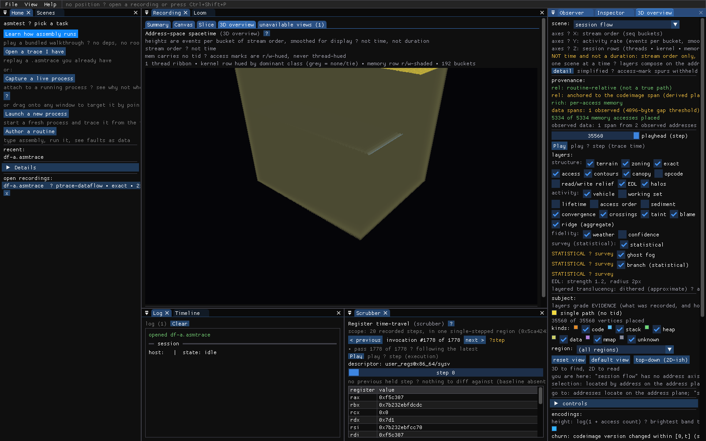

# The desktop GUI and its 3D scenes

The desktop app replays an `.asmtrace` recording. Most of its views are flat —
a summary, a canvas, a timeline, a register scrubber, a whole-session strip.
This page is mostly about
the one that is not: the **3D overview**, which draws a recording as geometry.

Every image here was produced by `make gui-shots` from a live capture of a
sample program in this repository. Nothing is mocked up, and the section at the
end shows how to reproduce all of it.

## Three time axes, deliberately not fused

The single most common misreading of these images is that they share one clock.
They do not, and the app says so on the plane's own axis label:

> NOT one clock: the terrain playhead (trace-residency time), the vehicle's own
> followed step, and the flat views' execution step are three separate axes

The terrain's playhead walks **trace-residency time**. The vehicle that follows
a worldline advances by its **own followed step** — the worldline itself lies
flat on the terrain rather than rising with trace time. The flat views have a
third axis, **execution step**.
Fusing them would be convenient and wrong, so the app keeps them apart.

## The workspace


A persistent task rail on the left, the open recording in the centre, the
Inspector on the right, and the session log below. The view tabs are
data-driven: a recording only offers the views it can actually fill, and the
ones it cannot collapse into a single **"unavailable views (N)"** affordance
that still names each absent view *and the machine reason it is absent*. That is
the app's habit throughout — an absence is stated, never hidden.

The newest flat view is the **Session strip**: the whole session as per-thread
lanes with run seams, a kernel rail, address bands, and a run-length density
fill, simplified to the top lanes by default — the rest stay counted, never
vanished. Its 3D companion is the [session flow scene](#session-flow) below.


## The 3D HUD


The HUD is where a scene declares what it is. From the top: which **substrate**
is being drawn, what its **axes mean** (including what they are *not*), the
**provenance** chips grading the evidence, the **layer** toggles grouped by what
kind of claim they make, and the **encodings** legend.

The layer registry currently carries 25 layers; this page shows the terrain
family. Beyond it, the **causal** group — `crossings`, `taint`, `blame`,
`ridge` — and the statistical branch-mispredict layer are on by default, and
each grades its own evidence and refuses in place when its stream is absent.

Two things in it are worth calling out, because they are the reason the rest of
the page can be trusted. Layers grade *evidence* — what was recorded and how
well — while filters choose *subject*. And a layer that cannot draw something
says why, in place, rather than drawing nothing: *"this recording carries no
`blame` attributions, so there are no cones to overlap, and this layer will not
derive any."*

In the shots below the HUD is collapsed so the geometry is the subject.

## The address plane

The default substrate. X and Z are the **address space**. The address→cell
layout is selectable: the default **region atlas** packs each mapped region
into its own serpentine-filled rectangle, labelled in place, so a region's
addresses stay inside its tile; the **Hilbert curve** layout instead keeps
global address locality, so addresses close in memory stay close on screen.
Height is access density. A trajectory is one execution path threading across
it — it lies flat on the terrain and is read through the playhead.

Verbatim, from the app:

| Axis | Means |
|---|---|
| X | `address (the address plane's u)` |
| Y | `terrain height = access density (log). A worldline does NOT rise with trace time: it lies flat and is read through the playhead. The opt-in lifetime / ribbon / sediment layers DO stand trace time on this axis` |
| Z | `address (the address plane's v)` |


Layers compose **on this plane only**, never across substrates — two meanings on
one screen position is exactly what the layer registry exists to prevent.

### The simplified posture

By default the scene draws its **simplified posture**: the eight most active
worldlines (hue-distinct paths are readable at eight, not at two hundred), with
the five per-event spike layers — access marks, read/write relief, working set,
lifetime, sediment — withheld. What was withheld is **counted, never
vanished**: a placard states how many worldlines and marks are hidden, and the
HUD's **detail** toggle brings the full population back.

### Zoning and contours


`zoning` hues the terrain by what *kind* of region an address is in — code,
stack, heap, data, mmap, unknown. `contours` adds iso-density bands, which are a
re-encoding of height rather than a new claim.

In a serve capture the plane also **names** its regions from the recording's
own address-space map (the `vmmap` events a serve session emits, re-sent only
when the map changes): the pick detail and the region roster show the
mapping's name with a provenance chip, instead of a bare address range.

### Canopy and opcode


`canopy` answers "which library is hot as a whole"; `opcode` classifies what
kind of work happens in each cell.

### Access and relief


`access` draws a spur from a PC vertex to the data cell it touched. `relief`
splits that into read and write twins. Both are per-event spike layers, so the
[simplified posture](#the-simplified-posture) withholds them until the detail
toggle is on — the placard counts what is hidden.

### Weather and ghost fog


These two are **fidelity** layers: they encode how much to trust what you are
seeing. `weather` is the fidelity sky; `ghost fog` is the separate stippled
statistical terrain, kept visually distinct from exact evidence so sampled
residency can never be mistaken for a recorded path.

## Scenes whose axes are not addresses

Five questions have a load-bearing axis that is **not** an address. Forcing them
onto the plane would fabricate a correspondence the recording does not carry, so
each gets its own substrate. **These do not compose** — the pane shows one at a
time, and never two together.

### Invocation stack


One routine's control flow *across its calls*. X and Z stay the Hilbert plane;
Y becomes a discrete call ordinal.

> Y: `invocation # — a discrete call ordinal`
>
> NOT a time and never scrubbed: the gap between two invocations is unobserved,
> of unknown length

Filled by `trace-blend.asmtrace`. Each `coverage` event closes one invocation, so
asking for 12 gives 12 slabs.

### Module excursion ribbon


Which thread is in which library, when. One sheet per thread.

> X: `call order (the recording's own event seq)`
> Y: `call depth (the engine's effective, focus-rebased depth)`
> Z: `thread lane — one sheet per tid`
>
> NOT either playhead and not a magnitude: depth is a stack property, and a
> capped floor is a clipped edge, not a bottom

Filled by `tree.asmtrace`. Unresolved modules keep their own hue and are never
merged into a resolved one.

### SIMD lane prism


Inside one wide vector register, over its writes.

> X: `byte / element index inside the register`
> Y: `byte magnitude (0..255)`
> Z: `stacked writes, oldest nearest`
>
> NOT wall clock and NOT an address: there is no address inside a register, and
> Z counts recorded writes, not elapsed time

Filled by `df-a.asmtrace`. One caveat the scene states itself: **the recording
does not carry SIMD element width**, so the lane width is derived from the
*mnemonic* — `paddd` is dword lanes, `paddb` is byte lanes. A mnemonic the
classifier cannot name renders at a default width and says so.

### Divergence worldline


Two recordings, one shared prefix, then a fork.

> X: `recording side — A on the left, B on the right`
> Y: `execution step`
> Z: `register-class lane of a rib (GPR / vector / flags / PC / other)`
>
> NOT a proof of instruction correspondence past the fork: after the streams
> part, A's step n and B's step n need not be the same instruction

Needs **two** recordings of the same code run on different data. The two sides
here differ only in the `--seed` passed to the sample program, which fixes a
runtime variable that selects a branch inside `blend_tile`. Both runs execute
the same binary and share an identical prefix; the branch is where they part.

Making that selection at *compile* time would break the scene rather than
sharpen it: the two sides would then be different code, and the pair would be
refused rather than drawn.

This scene is also the one that needs the most from a recording — three streams
at once, which is why the capture asks for `insns` (see below).

### Session flow



The whole session as flow. This is the 3D companion of the **Session strip**
view — the same rows (one per thread, plus the kernel rail and the memory
channel), drawn as smooth, depth-stacked ribbons whose height is a bucketed
activity rate over the recording's own stream order, with seam walls at the
strip's run boundaries.

> X: `stream order (seq buckets)`
> Y: `activity rate (events per bucket, smoothed for display)`
> Z: `session rows (threads · kernel · memory)`
>
> NOT time and not a duration: stream order only, and a height is a bucketed
> rate, never a measured interval

Like the strip, it opens for any recording that carries an event stream to
bucket — it takes no projection and carries no terrain.

A rib's thickness is how many registers disagree at that step. A **hollow** rib
means at least one side had no computed delta there, so agreement was never
observed — drawn at a minimum width rather than zero, because a zero-width rib
would render "we did not look" as "they agreed".

## Reproducing these

### 1. Set up the host

Attaching to a process you did not launch needs permissions a hardened desktop
Linux does not grant by default. See
[Host setup for tracing](../getting-started/host-setup.md).

On the reference host these images were made on, two gates were measured:

- `kernel.yama.ptrace_scope` was `1`, the Ubuntu default. The sample program
  calls `prctl(PR_SET_PTRACER, PR_SET_PTRACER_ANY, …)`, which is what lets the
  attach succeed *without* changing the host at all.
- `kernel.perf_event_paranoid` was `4`, so IBS was unavailable and `--sample` /
  `--auto --sampler=ibs` could not be used. Read yours with
  `sysctl kernel.perf_event_paranoid`.

### 2. Build and capture

```
make cli desktop
make gui-shot-recordings
make gui-shots
```

`gui-shot-recordings` starts the sample program and captures it four times.
`gui-shots` renders the manifest and then checks the images are correctly sized,
non-blank, and all distinct.

### 3. Why four recordings, and why `--serve`

**Four recordings, not one**, and that is structural: `call` events and `df_*`
events come from different engines, and a capture session runs one engine at a
time.

| Recording | Session | Fills |
|---|---|---|
| `tree.asmtrace` | `mode: tree` | Module excursion ribbon |
| `trace-blend.asmtrace` | `mode: trace` over `blend_tile` | Invocation stack |
| `df-a.asmtrace` | `mode: dataflow` over `blend_tile`, continuous | Address plane, lane prism, session flow, divergence A |
| `df-b.asmtrace` | the same, against a `--seed 2` process | Divergence B |

They are captured through `asmspy --serve` rather than the headless
`--record=` path, and that is not a stylistic choice. The **address plane** is
placed from `codeimage` events, and `codeimage` is emitted only inside a serve
session. Captured the other way the plane is empty, `address plane` is offered
disabled with its reason, and a screenshot photographs a placard rather than a
scene.

The 3D overview *tab* itself is no longer gated on `codeimage`. It opens for any
substrate the recording can fill — a `coverage` block set, a `call` tree, or wide
register writes — because the divergence worldline, the module excursion ribbon
and the SIMD lane prism take no projection and carry no terrain. Only the plane
needs one.

`--fpregs` appears in the dataflow sessions for the **Scrubber's** wide register
deck. The lane prism does not need it: the dataflow producer reads XMM operands
directly.

Three Settings toggles shape a **live** session's 3D pane, all ON by default:
**live union weave** (the pane accumulates every capture the session makes —
the in-memory twin of a `--record` tee — so a fresh Start adds to the scene
instead of replacing it), **stable plane layout** (regions pack the plane in
first-seen order, so a region already placed keeps its slot when a later
capture adds more), and **GPU 3D rendering** (turning it off takes the same
honest degraded 2D branch a no-GL build shows, presented as your Settings
choice, never as a missing capability).

`insns` is what makes the divergence pair comparable at all. That scene needs
three streams in one recording — `codeimage` so the 3D pane exists, `trace` or
`coverage` to **align** the two sides, and `statediff` for the ribs — and until
`insns` existed no single session produced all three. Only the dataflow engine
emits `statediff` (it is a delta of the per-step register ring) and only the
region engine emitted `trace`, so the scene refused the pair with *"both
recordings need a trace or coverage stream to be aligned"*. `insns` has the
dataflow session also state the instruction order it already single-stepped
through. It is off by default, so existing recordings are unchanged.

### 4. The sample program

`cli/scenes_victim.c` exists so these scenes have something honest to draw. Its
shape is the requirement — each part is there to satisfy one scene's data gate:

| Part | Feeds |
|---|---|
| `blend_tile()` — SSE work on a 16-byte tile, entered constantly | the lane prism's wide register writes, and the invocation stack's repeated entries |
| three worker threads descending through `walk_heap` / `sort_batch` / `mix_math` into libc and libm | the ribbon's thread lanes, call depths and module colours |
| a strided walk over a few hundred KB of heap | the plane's observed data spans |
| `--seed N`, which fixes a runtime variable selecting a branch in `blend_tile` | the divergence fork — a shared prefix, then two parting streams |

The seed changes **runtime data only, never the compiled code**. That is
deliberate: the divergence scene compares two recordings of the same routine, so
a variant that selected its path with a `#define` would make the two sides
different code and get the pair refused instead of drawn.
