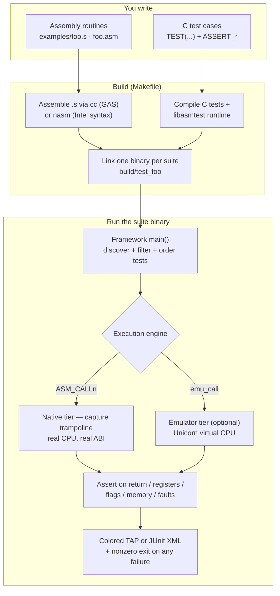

# asm-test

**A C-hosted unit-testing framework for assembly language.**

Write assembly routines, call them from C test cases *through the real ABI*, and
assert on the results — return values, **CPU registers**, **flags**, and
**memory**. Tests are auto-discovered, run in isolation, and reported TAP-style
with a nonzero exit on failure.

```c
#include "asmtest.h"

extern long add_signed(long a, long b);   // routine under test (in add.s)

TEST(arith, adds_two_numbers) {
    ASSERT_EQ(add_signed(2, 3), 5);
}

TEST(arith, preserves_callee_saved_and_clears_carry) {
    regs_t r;
    ASM_CALL2(&r, add_signed, 2, 3);
    ASSERT_EQ(r.ret, 5);
    ASSERT_ABI_PRESERVED(&r);     // rbx, rbp, r12–r15 restored
    ASSERT_FLAG_CLEAR(&r, CF);
}
```

The framework provides `main()`, discovers every `TEST(...)`, runs each one in a
forked child with a timeout, and prints a colored summary.

## How it fits together

You write the assembly routines and the C tests; the Makefile assembles,
compiles, and links them into one binary per suite; the framework's runner
discovers the tests and drives each routine through the **real calling
convention** — either natively (a capture trampoline on the real CPU) or, opting
in, inside a virtual CPU (the [emulator tier](emulator.md)) — then asserts on the
result and reports.



## Why asm-test

Existing tools either run a whole binary per case and only see *exit status and
stdout*, or assert from inside the assembly itself. asm-test fills the open
niche: a **C-hosted** framework that calls assembly through the **real calling
convention** and inspects registers, flags, and memory afterward — with proper
discovery and reporting. See [Design & background](design.md) for the prior-art
comparison and roadmap.

## What you get

- **Auto-discovered `TEST(...)`** cases, a provided runner, per-suite
  `SETUP`/`TEARDOWN`, `SKIP(reason)`, and colored TAP output.
- A full **assertion library** — signed/unsigned integer comparisons, strings,
  memory (with a hexdump diff), floating-point (ULP-aware), and SIMD lanes.
- **Register, flag, and ABI-preservation capture** through a real call, plus the
  full System V call model: arbitrary arity, struct returns, struct-by-value,
  floating-point, and 128-bit vectors.
- **Differential / property testing** against a C reference model over fuzzed
  inputs, with reproducible seeds.
- A robust **runner**: per-test `fork()` isolation, timeouts, crash/hang
  containment, filtering, shuffling, parallelism, and JUnit output.
- **Benchmark mode** reporting cycles per call.
- An optional **emulator tier** (Unicorn) that runs a routine inside a virtual
  CPU — x86-64, AArch64, RISC-V, ARM32, and the Windows x64 ABI — to read the
  *full* register file, catch precise faults, and measure branch coverage.
- **Portability** across x86-64 and AArch64, Linux and macOS, with GAS and NASM
  assembler backends.

## Where to start

- New here? Read [Installation](installation.md) then the
  [Quick start](quickstart.md).
- Writing your first suite? See [Writing tests](writing-tests.md) and the
  [Assertion reference](assertions.md).
- Consuming the framework from another project? See
  [Using asm-test in your project](integration.md).
- Driving it from another language? See [Language bindings](bindings.md) for
  Python, .NET, and Go examples.

```{toctree}
:maxdepth: 2
:caption: Getting started
:hidden:

installation
quickstart
writing-tests
```

```{toctree}
:maxdepth: 2
:caption: Guides
:hidden:

assertions
abi-capture
floating-point-simd
property-testing
runner
benchmarks
emulator
win64
```

```{toctree}
:maxdepth: 2
:caption: Reference
:hidden:

portability
integration
bindings
packaging
ci
api-reference
```

```{toctree}
:maxdepth: 1
:caption: Project
:hidden:

design
changelog
```
