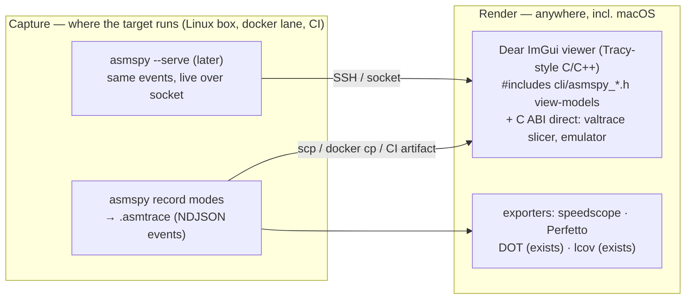

# Analysis: desktop GUI for the tracing and framework capabilities

*Status: analysis / ideation, adversarially reviewed. An exploration of how the
repo's tracing and testing capabilities could be visualised and interacted with
in a desktop GUI — first a broad proposal, then an independent review of that
proposal against the code, then the corrected design. Derived from the source of
record — [cli/asmspy.c](../../../cli/asmspy.c),
[cli/asmspy_engine.c](../../../cli/asmspy_engine.c), the pure view-model headers
([cli/asmspy_logview.h](../../../cli/asmspy_logview.h),
[cli/asmspy_graphsort.h](../../../cli/asmspy_graphsort.h),
[cli/asmspy_treefilter.h](../../../cli/asmspy_treefilter.h),
[cli/asmspy_dataview.h](../../../cli/asmspy_dataview.h),
[cli/asmspy_autoregion.h](../../../cli/asmspy_autoregion.h)),
[include/asmtest_valtrace.h](../../../include/asmtest_valtrace.h),
[include/asmtest_emu.h](../../../include/asmtest_emu.h),
[include/asmtest_hwtrace.h](../../../include/asmtest_hwtrace.h),
[include/asmtest_ibs.h](../../../include/asmtest_ibs.h). Narrative guides:
[asmspy](../../guides/tracing/asmspy.md), [tracing index](../../guides/tracing/index.md),
[data-flow tracing](../../guides/tracing/data-flow.md),
[cross-system benchmarking](../../guides/cross-system-benchmarking.md). Companion
analyses: [tracing decision matrix](tracing-decision-matrix.md),
[data-flow capture](data-flow-capture.md), [trace parity matrix](trace-parity-matrix.md).*

## Summary

A desktop GUI over this repo is fundamentally a **renderer + driver over feeds
that already exist**: nearly every capability collapses into five renderable
data shapes, each with a JSON/DOT/struct representation today. The initial
proposal (a Tauri app streaming `asmspy --json`) did not survive review — the
JSON exporters are batch snapshots, the highest-value view's producer is not
reachable from the proposed stack, and one flagship view assumed data no tier
records. The corrected design inverts the build order: **define a recording
format (`.asmtrace`, NDJSON events) first**, ship exporters and a
cross-platform def-use slice explorer on the emulator producer, and only then
add a live `asmspy --serve` transport that streams the same events by swapping
NDJSON serializers in for the existing ncurses sinks.

One sentence: **the first proposal designed renderings; the repo needs a
protocol.** Once the event stream exists, the differentiated views fall out
almost mechanically, and the genuinely new engine work is small and explicit.

## The data substrate: five renderable shapes

| Shape | Produced by | Existing feed |
|---|---|---|
| **Trace + coverage** (`insns[]/blocks[]/*_total/truncated`) | all 8 producers (emulator, DynamoRIO, Intel PT, AMD LBR, CoreSight, single-step, ptrace, Mach) — one identical struct | `emu_trace_report`, lcov, `asmtest_hwtrace_render`, `--stream` (text) |
| **Register/flag/memory state** (`emu_x86_regs_t`, `regs_t`) | emulator tier, capture trampoline | `emu_result_t`; layout published by `asmtest_abi.json` |
| **Def-use graph + slices** (L0/L1/L2) | emulator oracle, scoped ptrace, DynamoRIO, Pin probe | `asmspy --dataflow --json` |
| **Weighted call graph / hot-edge histogram** | asmspy graph/tree engines, AMD IBS-Op | `--graph/--tree/--procs --json` + `--dot`, `--sample --json` |
| **Test / bench / capability results** | runner, bench-report, features sweep | JUnit XML, `--bench-format=json`, `features.json`, `perf-history.jsonl` |

The single most reusable fact: every trace producer fills the same
`asmtest_trace_t`, so **one trace viewer covers all backends** — with the
caveat below about what that means live vs in the library.

## Verified constraints (review findings)

Any implementer must design around these; each was confirmed against the code
during review.

1. **The headless `--json` exporters are batch, not streams.** `cmd_graph`,
   `cmd_tree`, `cmd_procs`, `cmd_sample`, `cmd_watch`, `cmd_dataflow` run the
   engine to completion (n calls / one window / one invocation) and print one
   JSON document at exit ([cli/asmspy.c](../../../cli/asmspy.c) ~1031 for the
   graph emitter). `--log` and `--stream` stream, but **text only — no JSON
   mode exists for them**. A GUI polling by re-spawning these commands would
   re-`PTRACE_SEIZE`/detach every refresh — perturbing, and JIT-hostile in
   exactly the way the two-phase detach machinery exists to survive *once*.
2. **One ptracer per target.** The single-step subcommands (`--trace`,
   `--stream`, `--graph`, `--tree`, `--dataflow`, `--log`) are mutually
   exclusive per pid. A concurrent multi-panel *live* dashboard over one
   process is physically impossible; live ptrace views must be time-sliced.
   Only AMD IBS-Op (`--sample`) and hardware watchpoints (`--watch`) coexist
   with a ptrace view.
3. **No per-step register-file producer exists.** `emu_result_t.regs` is the
   file *after* the run; `asmtest_trace_t` is offsets only; the data-flow tier
   records **sparse per-operand values** (`at_val_rec_t`: only the operands the
   instruction touched, no RFLAGS location, wide XMM/YMM values often
   `value_valid=false`, register reads deliberately unannotated). A "scrub to
   step N and show the whole register file" view has **no backing data** — it
   requires a new emulator feature (per-step `UC_HOOK_CODE` register capture),
   not a rendering.
4. **IBS-Op emits edges, not stacks.** `asmtest_ibs_edge_t` is
   `{from, to, count, mispred, is_return}` with the tid dropped at drain. No
   nesting exists, so no flame graph — the faithful rendering is an
   edge-weighted hot graph or ranked table.
5. **asmspy has no Intel PT backend.** Its live sources are ptrace single-step
   (exact, per-invocation) and IBS (statistical edges) — not comparable
   side-by-side. In the library, the hardware-backend dropdown collapses to
   SINGLESTEP on most hosts (PT is bare-metal-Intel-Linux; LBR Zen 4+;
   CoreSight board-gated; macOS has no hardware backend). The real
   completeness story is the features sweep's `trace_insns` vs `insns_truth`.
6. **The Rust *crate API* has no dataflow module.** *(Corrected 2026-07-21 —
   as originally filed this said `ValueTrace` + `forward_slice`/`backward_slice`
   "ship in Python, Node, Ruby, Lua, C++, and .NET — not Rust, Go, Zig, or
   Java", which was already false when written: commit `5cd22a5`, 2026-07-18,
   two days before this doc, gave all ten bindings the def-use/slice surface —
   `bindings/rust/test_dataflow.rs`, `go/cmd/dataflowsmoke`,
   `java/TestDataflow.java`, `zig/src/test_dataflow.zig`.)* The nuance that
   survives: in Rust and Go that surface lives in **smoke drivers carrying
   their own `extern` declarations**, not in the published crate/package API
   (`bindings/rust/src/` has no dataflow module), so a Rust daemon still cannot
   reach the def-use slicer through the crate without first promoting those
   declarations into the API. And `asmspy_engine.c` lives in `cli/`, not a
   linkable library; re-implementing attach elsewhere would abandon tested
   behavior (two-phase detach, own-`int3` delivery by `si_code`, JIT
   perf-map/jitdump refresh-on-miss, the one-tracer-thread rule).
7. **The region view is per-invocation.** The live "trace canvas" over an
   attached process is a sequence of discrete invocation snapshots (`sample #N`,
   re-rendered each time the target calls the function) — never a continuous
   scrubbable stream, and never complete for a function that does not return.
   The continuous canvas is an emulator/Author-mode concept.

## Product shape: two modes

- **Author mode** — cross-platform (including macOS). Drives the *library*
  (emulator, hwtrace, valtrace) plus static artifacts (JUnit, bench,
  features). Deterministic, unprivileged, CI-friendly.
- **Observer mode** — Linux x86-64 **and AArch64** (the arch shim covers
  both). Live out-of-band attach via the asmspy engine; leaves the target
  untouched on detach.

## View catalog (post-review verdicts)

| View | Verdict | Notes |
|---|---|---|
| **Def-use slice explorer** | **Build — the crown jewel** | The only view no existing tool offers: node-link graph over `defuse[]`, click a step → backward/forward slice cones lit (`asmtest_slice_backward/forward`). The **emulator producer is cross-platform, deterministic, no ptrace, no root** — ships early, everywhere, seeded by the conformance corpus. |
| Operand-value timeline | Build now | What each step read/wrote — the honest widget the dataflow capture supports today; `asmspy_dataview.h` already computes the annotations. |
| Register time-travel scrubber | Build **after funding the producer** | Small emulator-only addition: per-step register capture ring via `UC_HOOK_CODE`. Until then it has no data and must not be scheduled as UI work. |
| Trace canvas (heat + block boundaries + coverage gutter) | Build (Author mode) | Per-offset execution counts, block partition, lcov overlay on the original `.s`; coverage union across inputs as accumulating heat. Observer-mode variant is "latest invocation #N" with the truncation flag, not a stream. |
| Hot-edge graph (IBS) | Build — renamed | Edge-weighted graph / ranked table with mispredict % as a channel. **Not a flame graph** (no stacks). Carry `branch/total`, `THROTTLED`, `lost`, window ms in the chrome. |
| Call graph / tree | Build as sorted list + drill-in | Port asmspy's interaction (sort toggle, `Enter` → callers/callees modal). Force-directed layout only on a **frozen** snapshot — a live-updating layout thrashes. `--dot` export already covers offline rendering. |
| Watchpoint timeline | Build — **promoted** | The sleeper hit: native speed between hits, names each toucher + value + direction. Lowest-perturbation live view in the tool. |
| Syscall stream | Build | Decoded buffers/paths/sockaddrs on click; redact-by-default must cover paths and sockaddrs too (the sink already hands the decoded payload separately from the formatted line — a natural gate). |
| Process topology map | Build | Fingerprint cards (runtime badge, threads, RSS, seccomp); drill node → call graph, matching the TUI's `TOPO_ACT_DRILL` flow. |
| Backend completeness view | Build — replaces "backend diff" | Render the features sweep (`trace_insns` vs `insns_truth`, `skip_reason` per tier×backend×arch). The live single-step-vs-PT side-by-side was infeasible as specified. |
| Test dashboard / capability heatmap | Minimal or skip | Commodity: CI already renders JUnit; the features table is trivial static HTML and must run on the target host anyway. |
| **ABI x-ray (teaching mode)** | Ideate — high leverage | Animate a call deterministically on the emulator: args marshalling into registers/stack slots (SysV vs Win64 contrast), eightbyte classification, sentinel-seeded callee-saved checks, flag effects. Seeded by the conformance corpus; serves the documented [classroom use case](../../guides/classroom.md). |

**GUI-exceeds-TUI wins available on day one:** the tree filters
(`--depth`/`--focus`/`--module`) exist headlessly but the TUI passes `NULL` —
a filter panel closes a real gap; `--tid` pinning and `--follow` as first-class
toggles (with the mutual-exclusion rule enforced); the `--auto` flow ("attach
and show me what this process is doing" — entry-edge ranking picks the hot
function) plus `SYMS_SORT_HOT` as the front-door target picker: attach → hot
functions ranked live → click → trace/dataflow.

## Architecture

### The keystone: `.asmtrace` before `--serve`

Define the event schema once, as a **recording format** (NDJSON event log +
metadata header), and everything else becomes a reader or writer of it. This
dissolves three verified constraints at once:

- *batch-vs-stream* — record serially, view offline;
- *one ptracer per target* — record views one at a time, tile them **all** in
  replay;
- *the remote gap* — the dev host may be macOS while targets live in this
  repo's own `docker-*` lanes; capture there
  (`asmspy … > run.asmtrace` in the container or over SSH), render here.

Recordings also enable **diffing** — before/after an optimisation: coverage
diff, hot-edge diff, cycles trend — extending the repo's existing
golden + `perf-history.jsonl` culture to traces.

`--serve` is then "the same events, live": each engine already takes
`(pid, …, atomic_bool *stop, sink, void *ctx)` and fires typed sinks on the
tracer thread; a serve mode swaps NDJSON serializers in for the ncurses sinks
(mechanically mirroring `live_graph_sink`, `sample_view_sink`, …), confined to
`asmspy.c` with the engine untouched. One attach per session (no churn), and
every hard-won guarantee — two-phase detach, own-`int3` delivery, JIT map
refresh, bounded entry waits — comes along for free. Control protocol: select
pid + mode + params, pause, stop; sorting/filtering stay client-side (the pure
view-model headers define those semantics).

### Stack: Dear ImGui (Tracy model), not a webview

Decisive facts:

- The pure, unit-tested view-model headers can be `#include`d directly — the
  GUI gets the exact sorting/filter/viewport semantics the TUI ships, under
  the same tests (`cli/test_view.c`, `test_graphsort.c`, `test_treefilter.c`).
  A TS/web reimplementation reintroduces the parity-drift surface this repo
  maintains an entire conformance harness to kill.
- The C ABI reaches the valtrace slicer and emulator directly — no FFI gap
  (the Rust *crate API* still lacks a dataflow module — see corrected
  constraint 6 — so a Rust-daemon seam for the flagship view would first need
  the smoke driver's `extern` declarations promoted into the crate).
- The audience runs Tracy and perf, not Electron apps; Tracy is the existence
  proof that ImGui handles zoomable timelines and dense live data at this
  fidelity.

If a web frontend ever becomes non-negotiable for reach, keep the backend
C-direct (or the Python binding — the only one that both reads the ABI
manifest and ships the full slicer) and treat the frontend as a renderer of
`.asmtrace`/speedscope files, never a live driver.

## UX principles (the repo's honesty culture, carried into the GUI)

- **Truncation is loud** — `truncated=true` is a persistent banner, never a
  silent cutoff.
- **Statistical ≠ exact** — IBS/LBR views state "proves an edge *was* taken,
  never that code did *not* run"; `branch/total`, `THROTTLED`, `lost`, and the
  window stay in the chrome.
- **Self-skip shows why** — a tier that cannot run renders its `skip_reason`;
  the capability view is a first-class citizen, not an error state.
- **Crawl warning + JIT safety** — single-step views badge the slowdown and
  steer live-JIT targets to IBS.
- **Sensitive captures redact by default** — buffers, paths, and sockaddrs;
  explicit reveal. Pin/watch captures may hold secrets.
- **Clean detach** — quitting a live view leaves the target untouched (the
  engine's two-phase detach already guarantees this; the GUI must never
  bypass it).
- **Drop accounting** — any bounded ring or backpressure drop is reported,
  never silently truncated.

## Phasing (unique value first; producers before renderers)

1. **`.asmtrace` event schema + record modes + exporters** — speedscope /
   Perfetto from stream/sample, DOT passthrough, features table. Defines the
   contract; ships cross-platform value immediately.
2. **ImGui viewer: replay + def-use slice explorer** on the emulator
   producer, conformance-corpus-seeded golden demos. The differentiated view,
   on every OS, no privileges. Includes the operand-value timeline.
3. **`asmspy --serve` + live Observer views** — `--auto`/hot-picker front
   door, syscall stream, watchpoint timeline, region view as "latest
   invocation #N", time-sliced ptrace modes with IBS/watch alongside. Local
   Linux/AArch64 or over SSH into the docker lanes.
4. **Per-step emulator register capture → the real scrubber**, then the ABI
   x-ray teaching view on top.

### Explicit engine work items (small, now correctly ordered)

| Item | Where | Size |
|---|---|---|
| `.asmtrace` NDJSON serializers per sink + record mode | `cli/asmspy.c` (new sinks beside the ncurses ones) | small |
| `--serve` control loop (pid+mode+params, pause, stop) over stdout/unix socket | `cli/asmspy.c` | small |
| JSON mode for `--log`/`--stream` (today text-only) | `cli/asmspy.c` | small |
| Per-step register capture ring (opt-in) | `src/emu.c` (`UC_HOOK_CODE`) | small–medium |
| speedscope / Perfetto exporters | new tool or `cli/` | small |

## Rejected alternatives (for the record)

- **Tauri + Rust trace daemon** — the Rust *crate API* lacks the dataflow
  module (per corrected constraint 6, the surface exists only in the
  `test_dataflow.rs` smoke driver's own `extern` declarations, not in
  `bindings/rust/src/`); a webview discards the tested C view-models;
  re-implementing attach outside `asmspy_engine.c` risks the
  detach/int3/JIT-refresh guarantees.
- **Spawn-and-poll `asmspy --json`** — batch exporters + per-poll
  seize/detach churn (constraint 1/2 above).
- **Live force-directed call graph** — layout thrash on every snapshot; the
  sorted-list + drill-in interaction is strictly better live, graph layout on
  frozen exports.
- **IBS flame graph** — category error (edges, not stacks).
- **A full custom shell for commodity views** — JUnit dashboards, capability
  tables, and DOT graphs are already well served by existing renderers;
  custom UI is reserved for what nothing else renders (slicing, operand
  timelines, the scrubber, the ABI x-ray).
