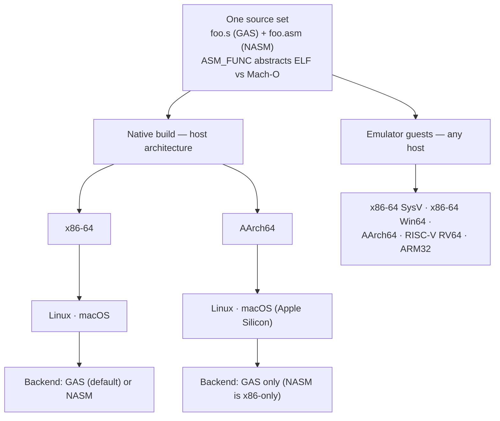

# Portability & assemblers

asm-test runs the **same sources** on x86-64 and AArch64, on Linux and macOS,
through either of two assembler backends. This page explains how that works and
how to choose a backend.

## Supported targets

| | Linux | macOS |
|---|---|---|
| **x86-64** | ✓ | ✓ |
| **AArch64** | ✓ | ✓ (Apple Silicon) |

CI runs the suites on all four combinations (`ubuntu-latest`,
`ubuntu-24.04-arm`, `macos-latest`, `macos-13`).

One source set reaches every target two ways: a **native** build for the host
architecture (through either assembler backend), and the **emulator** guests,
which run on any host:



## One source, two object formats

The `ASM_FUNC` / `ASM_ENDFUNC` macros in `include/asm.h` abstract the ELF vs
Mach-O differences — symbol decoration (the leading `_` on Mach-O), `.globl`,
alignment, and size directives — so a routine source builds unchanged on Linux
and macOS. Because `;` is a statement separator on x86 but a **comment** on
AArch64, the macros are `.macro`-based rather than relying on `;`.

Architecture-specific instruction bodies live behind preprocessor guards:

```asm
#include "asm.h"

ASM_FUNC add_signed
#if defined(__x86_64__)
    movq    %rdi, %rax
    addq    %rsi, %rax
    ret
#elif defined(__aarch64__)
    add     x0, x0, x1
    ret
#endif
ASM_ENDFUNC add_signed
```

The C compiler (`cc` — gcc or clang) assembles the GAS-syntax `.s` sources
directly, so **no separate assembler is required** for the default backend.

## Assembler backends

### GAS (default)

The default backend uses GAS syntax via the system C compiler. It is the only
backend on AArch64 (the `.s` sources assemble through the compiler's built-in
assembler, so nothing extra is needed there).

### NASM backend

An opt-in NASM backend ships **Intel-syntax** counterparts of the sources
(`foo.asm` beside `foo.s`) with their own `asm_nasm.inc` include. It is
**x86-64 only** (NASM is x86-only by design). Select it per build:

```sh
make ASM_SYNTAX=nasm test
```

This needs `nasm` installed (`make deps` provides it). The NASM sources are
exercised by their own CI job, so both backends stay in sync.

:::{note}
**On AArch64, GAS is the only backend.** A `make ASM_SYNTAX=nasm` build there is
not supported — write the AArch64 body in the `.s` source under
`#if defined(__aarch64__)` and assemble it with the default backend.
:::

## Register-snapshot fidelity

Native capture is defined as the **post-return** general-purpose registers plus
flags, with sentinel-based callee-saved checks — not an arbitrary mid-routine
snapshot, because the `call` itself touches state. When you need a mid-routine or
full-file view (or a non-host architecture), use the [emulator tier](emulator.md),
which has no such constraint and adds RISC-V and ARM32 guests on top.
