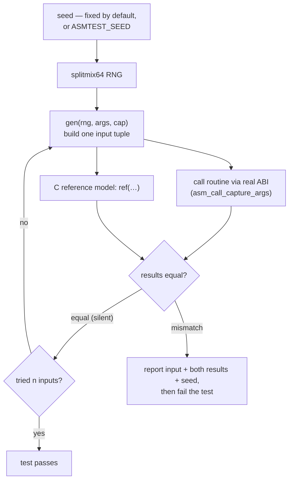

# Property / differential testing

Fixed example values catch the cases you thought of. Differential testing catches
the ones you didn't: you supply a **C reference model** of what the routine
*should* compute, plus a generator of random inputs, and the framework fuzzes
many inputs through the real ABI and asserts the assembly agrees with the model.



## The assertion

```c
ASSERT_MATCHES_REF1(fn, ref, gen, n);   // routine takes 1 long
ASSERT_MATCHES_REF2(fn, ref, gen, n);   // 2 longs
ASSERT_MATCHES_REF3(fn, ref, gen, n);   // 3 longs
```

There is one macro per integer arity because C cannot dispatch on a function
pointer's arity. `n` is the number of random inputs to try.

- `fn` — the assembly routine under test (called through
  `asm_call_capture_args`, i.e. the real calling convention).
- `ref` — a plain C function with the same signature that returns the expected
  value.
- `gen` — a generator that fills an input tuple from the RNG.

On the **first mismatch**, the offending input, both results, and the seed are
reported, and the test fails. Matching inputs are silent.

## The generator

A generator pulls from a seedable [splitmix64] RNG and writes up to `cap`
arguments:

```c
typedef int (*asmtest_gen_fn)(asmtest_rng_t *rng, long *args, int cap);
```

It returns how many arguments it produced. Helpers draw values:

```c
long asmtest_rng_long(asmtest_rng_t *rng);                 // full 64-bit
long asmtest_rng_range(asmtest_rng_t *rng, long lo, long hi);
```

## A complete example

```c
#include "asmtest.h"

extern long asm_abs(long x);     // routine under test

static long ref_abs(long x) {    // the model
    return x < 0 ? -x : x;
}

static int gen_one(asmtest_rng_t *rng, long *args, int cap) {
    (void)cap;
    args[0] = asmtest_rng_long(rng);
    return 1;
}

TEST(refmatch, abs_matches_model) {
    ASSERT_MATCHES_REF1(asm_abs, ref_abs, gen_one, 10000);
}
```

This calls `asm_abs` and `ref_abs` on 10,000 random inputs and fails at the first
disagreement, printing the input and both outputs.

## Reproducibility and CI

The RNG seed is **fixed by default**, so a failure reproduces exactly on the next
run while you debug. Override it with the `ASMTEST_SEED` environment variable so
CI can explore a different stream each run:

```sh
ASMTEST_SEED=12345 ./build/test_refmatch
```

When a failure is reported, the seed that produced it is printed — set
`ASMTEST_SEED` to that value to replay it.

## Pairs well with the emulator

Fuzzing a routine that might loop forever or fault is exactly where the
[emulator tier](emulator.md) shines: its instruction cap and fault hooks mean a
runaway input is reported rather than hanging or crashing the harness. The
[fork isolation](runner.md) in the native runner provides the same guarantee for
ABI-level property tests.

[splitmix64]: https://prng.di.unimi.it/splitmix64.c
