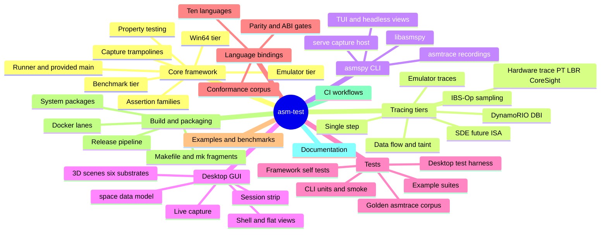

# Code map

A mind map of the repository: what lives where, what each part is for, and —
for every part — the documentation that covers it in depth. This page is the
*where*; [Features & support matrix](features.md) is the *what*, and
[Diagrams](diagrams.md) is the *how it flows*.

Parts marked **internal** are covered by working documents under
[`docs/internal/`](https://github.com/wilvk/asm-test/tree/main/docs/internal),
which are kept in-tree but out of the published site.

## The map

## Core framework

The test framework itself: you include `asmtest.h`, the framework provides
`main()`, and each `TEST(...)` drives an assembly routine through the real ABI.

| Part | Where | What it is | Documentation |
|---|---|---|---|
| Runner & `main()` | [`src/asmtest.c`](https://github.com/wilvk/asm-test/blob/main/src/asmtest.c) | Discovery, fork-per-test isolation, timeouts, `-jN`, TAP/JUnit | [The runner](../guides/runner.md) |
| Public API header | [`include/asmtest.h`](https://github.com/wilvk/asm-test/blob/main/include/asmtest.h) | `TEST`/`ASM_CALL*`/`ASSERT_*`, `regs_t` per ABI | [API reference](api-reference.md) |
| Assertion families | `include/asmtest.h` | Value, memory, register/flag/ABI, FP/SIMD, differential, emulator | [Assertions](../guides/assertions.md) |
| Capture trampolines | [`src/capture.s`](https://github.com/wilvk/asm-test/blob/main/src/capture.s), `capture.asm`, `capture_win64.asm` | Seed sentinels, real call, snapshot registers/flags | [ABI capture](../guides/abi-capture.md) |
| FP / SIMD / SVE capture | `src/capture.s` + `include/asmtest.h` | `ASM_FCALL*`, `ASM_VCALL*` (128/256/512-bit), SVE | [Floating-point & SIMD](../guides/floating-point-simd.md) |
| Property / differential engine | `src/asmtest.c` | Fuzzed inputs vs a C reference model, shrinking, seeds | [Property testing](../guides/property-testing.md) |
| Benchmark tier | `src/asmtest.c` | `BENCH(...)`, auto-calibrated cycles per call | [Benchmarks](../guides/benchmarks.md) |
| Emulator tier | [`src/emu.c`](https://github.com/wilvk/asm-test/blob/main/src/emu.c) + [`include/asmtest_emu.h`](https://github.com/wilvk/asm-test/blob/main/include/asmtest_emu.h) | Unicorn guests (x86-64 SysV/Win64, AArch64, RISC-V, ARM32), faults, guards, fuzzing | [Emulator tier](../guides/emulator.md) |
| In-line assembler / disassembler | `src/assemble.c`, `src/disasm.c` | Keystone text→bytes; Capstone diagnostics | [Disassembly](../guides/disassembly.md), [Features](features.md#in-line-assembler-optional-keystone) |
| Win64 tier & platform seam | `src/capture_win64.asm`, `src/platform_win32.c` | Microsoft x64 ABI, re-exec isolation, VEH guard | [Windows x64](../guides/win64.md) |
| FFI / binding ABI layer | [`src/ffi.c`](https://github.com/wilvk/asm-test/blob/main/src/ffi.c) | Opaque handles + `asmtest_abi.json` manifest for the bindings | [API reference](api-reference.md#binding-abi-multi-language), [Bindings](../bindings/index.md) |

## Tracing tiers & producers

Every backend fills the same `asmtest_trace_t` sink — the
[tracing hub](../guides/tracing/index.md) is the entry point, and the
[trace-backends diagram](diagrams.md#trace-and-coverage-backends) shows the
whole family at once.

| Part | Where | What it is | Documentation |
|---|---|---|---|
| Emulator trace & coverage | `src/trace.c`, `src/emu.c` | Guest instruction/block traces, lcov, source maps | [Execution traces](../guides/tracing/traces.md) |
| DynamoRIO tier | `src/drtrace_*.c`, [`drclient/`](https://github.com/wilvk/asm-test/tree/main/drclient) (probes) | In-process software DBI, Linux + macOS x86-64 | [Native runtime tracing](../guides/tracing/native-tracing.md) |
| Hardware trace | `src/hwtrace.c`, `pt_backend.c`, `amd_backend.c`, `cs_backend.c` | Intel PT, AMD LBR, CoreSight scaffold, auto-selection | [Hardware tracing](../guides/tracing/hardware-tracing.md), [AMD LBR tuning](../guides/tracing/amd-lbr-tuning.md) |
| Single-step tiers | `src/ss_backend.c` (in-process), `src/ptrace_backend.c` (out-of-process) | The universal exact backend; the managed-runtime path | [Native runtime tracing](../guides/tracing/native-tracing.md), [Scoped tracing](../guides/tracing/scoped-tracing.md) |
| IBS-Op statistical lane | `src/ibs_backend.c` | Sampled hot edges, out of band, unprivileged, any AMD Zen | [Hardware tracing](../guides/tracing/hardware-tracing.md) |
| Data-flow / value tiers | `src/dataflow_*.c`, `include/asmtest_valtrace.h` | Operand values → def-use → slices; five producers | [Data-flow tracing](../guides/tracing/data-flow.md) |
| eBPF detectors | [`bpf/`](https://github.com/wilvk/asm-test/tree/main/bpf) | `codeimage.bpf.c` (JIT emission), `branchsnap.bpf.c` (LBR boundary snapshot) | [Native tracing](../guides/tracing/native-tracing.md), [AMD LBR tuning](../guides/tracing/amd-lbr-tuning.md) |
| Intel Pin tools | [`pintool/`](https://github.com/wilvk/asm-test/tree/main/pintool), [`pintools/`](https://github.com/wilvk/asm-test/tree/main/pintools) | XED trace cross-check, probe-mode capture, libdft taint oracle | [Data-flow tracing](../guides/tracing/data-flow.md) (probe mode); rest **internal** |
| SDE future-ISA lane | `mk/sde.mk`, `Dockerfile.sde` | Real assertions on emulated APX / AVX10 / AMX | [SDE testing](../guides/tracing/sde-testing.md) |

## The asmspy CLI

One shipped binary. `.asmtrace` is not a binary but the NDJSON recording format
everything downstream (including the desktop app) consumes.

| Part | Where | What it is | Documentation |
|---|---|---|---|
| `asmspy` | [`cli/asmspy.c`](https://github.com/wilvk/asm-test/blob/main/cli/asmspy.c) | ncurses TUI + headless subcommands over the out-of-process tracer | [asmspy](../guides/tracing/asmspy.md) |
| Engines | [`cli/asmspy_engine.c`](https://github.com/wilvk/asm-test/blob/main/cli/asmspy_engine.c) | syscalls, stream, tree, graph, procs, region, dataflow, watch | [asmspy](../guides/tracing/asmspy.md) |
| Perf-free auto sampler | [`cli/asmspy_ptracesample.c`](https://github.com/wilvk/asm-test/blob/main/cli/asmspy_ptracesample.c) | `--sampler=ptrace`: residency → call-target expansion → arrival confirmation | [asmspy](../guides/tracing/asmspy.md), [Host setup](../getting-started/host-setup.md) |
| `--serve` capture host | `cli/asmspy.c` | NDJSON control loop the GUI spawns; emits `codeimage` + `vmmap` | [asmspy metrics](../guides/tracing/asmspy-metrics.md) |
| `.asmtrace` writer | [`cli/asmtrace_ndjson.c`](https://github.com/wilvk/asm-test/blob/main/cli/asmtrace_ndjson.c) | The shared recording format (header / events / `end` footer) | [asmspy metrics](../guides/tracing/asmspy-metrics.md) |
| `libasmspy` | [`cli/libasmspy.h`](https://github.com/wilvk/asm-test/blob/main/cli/libasmspy.h) | The tracer engine as a linkable library tier | [asmspy](../guides/tracing/asmspy.md) |
| Victims & smoke | `cli/*_victim.c`, `cli/cli_smoke.sh` | 19 fixture programs + the end-to-end smoke | [CI & Docker](ci.md) |

## Desktop GUI

A Dear ImGui trace viewer/debugger over the `.asmtrace` format — it links no
tracer; live capture spawns `asmspy --serve` (locally or over ssh).

| Part | Where | What it is | Documentation |
|---|---|---|---|
| Shell & dock layout | [`desktop/src/ui/`](https://github.com/wilvk/asm-test/tree/main/desktop/src/ui) | Data-driven tabs, panes, perspectives, settings, `--shot` renderer | [Desktop GUI & 3D scenes](../guides/desktop-gui-scenes.md) |
| Flat views | [`desktop/src/views/`](https://github.com/wilvk/asm-test/tree/main/desktop/src/views) | Summary, canvas, timeline, slice, diff, observer, loom, scrubber, ABI x-ray, Session strip | [Desktop GUI & 3D scenes](../guides/desktop-gui-scenes.md) |
| 3D scene system | [`desktop/src/scene3d/`](https://github.com/wilvk/asm-test/tree/main/desktop/src/scene3d) | Six substrates (address plane, divergence, invocation, module ribbon, lane prism, session flow), 25-layer registry, HUD | [Desktop GUI & 3D scenes](../guides/desktop-gui-scenes.md) |
| `space/` data model | [`desktop/src/space/`](https://github.com/wilvk/asm-test/tree/main/desktop/src/space) | Pure projection/terrain/trajectory model (no GL, no ImGui) | **internal** ([gui docs](https://github.com/wilvk/asm-test/tree/main/docs/internal/gui)) |
| Recording & live capture | [`desktop/src/doc/`](https://github.com/wilvk/asm-test/tree/main/desktop/src/doc), [`desktop/src/live/`](https://github.com/wilvk/asm-test/tree/main/desktop/src/live) | `.asmtrace` load, session union weave, `asmspy --serve` subprocess | [Desktop GUI & 3D scenes](../guides/desktop-gui-scenes.md), [Troubleshooting](troubleshooting.md) |
| Packaging | `packaging/debian-desktop/`, `packaging/appimage/` | `.deb` + AppImage (GPL-2.0 as distributed) | [Installation](../getting-started/installation.md#install-the-desktop-gui-app) |

## Tests

`tests/` holds the framework's own self-tests and the golden corpus; the bulk
of the repo's test mass lives beside what it tests.

| Part | Where | What it is | Documentation |
|---|---|---|---|
| Framework self-tests | [`tests/positive.c`](https://github.com/wilvk/asm-test/blob/main/tests/positive.c), `negative.c`, `expect.sh` | The runner meta-tests behind `make check` | [CI & Docker](ci.md) |
| Differential oracles | `tests/glob_parity.c`, `tests/grow_overflow.c` | Filter-glob vs `fnmatch`; overflow-checked pool growth | [CI & Docker](ci.md) |
| Portability gate | [`tests/portability/`](https://github.com/wilvk/asm-test/tree/main/tests/portability) | Compile-only C11/C++ consumer check | [Portability](portability.md) |
| Golden `.asmtrace` corpus | [`tests/golden-asmtrace/`](https://github.com/wilvk/asm-test/tree/main/tests/golden-asmtrace) | Byte-gated recordings consumed by cli + desktop tests; regenerate only in the `docker-cli` image | its [README](https://github.com/wilvk/asm-test/blob/main/tests/golden-asmtrace/README.md) |
| Example suites | `examples/test_*.c` | What `make test` actually runs (auto-discovered) | [Writing tests](../getting-started/writing-tests.md) |
| CLI units + smoke | `cli/test_*.c`, `cli/cli_smoke.sh` | asmspy engine units + the end-to-end smoke (`make cli-smoke`) | [CI & Docker](ci.md) |
| Desktop harness | [`desktop/test/`](https://github.com/wilvk/asm-test/tree/main/desktop/test) | 112 hand-rolled test binaries: replay, render, golden text, GL FBO | [CI & Docker](ci.md) |
| Win64 / Mach suites | [`tests/win64/`](https://github.com/wilvk/asm-test/tree/main/tests/win64), `tests/mach/` | Wine-run ABI/SEH/watchdog tests; the Darwin Mach stepper | [Windows x64](../guides/win64.md) |
| Fuzz shim tests | `examples/fuzz_*.c` + `mk/fuzz.mk` | libFuzzer/AFL++ must *find* planted crashes | [Fuzzing shim](../guides/fuzzing-shim.md) |
| Benchmark goldens | [`benchmarks/golden/`](https://github.com/wilvk/asm-test/tree/main/benchmarks/golden) | Deterministic emu instruction counts (`make bench-check`) | [Cross-system benchmarking](../guides/cross-system-benchmarking.md) |

## Language bindings

| Part | Where | What it is | Documentation |
|---|---|---|---|
| Ten bindings | [`bindings/`](https://github.com/wilvk/asm-test/tree/main/bindings) | Python, .NET, Go, Rust, C++, Zig, Node, Java, Ruby, Lua — FFI over the binding ABI | [Bindings overview](../bindings/index.md) + per-language pages |
| Conformance corpus | `bindings/conformance/` | Canonical routines + expected captures every binding must reproduce | [Bindings overview](../bindings/index.md) |
| Parity & ABI gates | `scripts/check-bindings-parity.sh`, `asmtest_abi.json` | Function-surface and struct-layout drift guards | [Bindings overview](../bindings/index.md), [Packaging](packaging.md) |
| Per-binding tier wrappers | `bindings/<lang>/…` | `drtrace`, `hwtrace`, and `dataflow` modules in every language | [Native tracing](../guides/tracing/native-tracing.md), [Data-flow tracing](../guides/tracing/data-flow.md) |

## Examples & benchmarks

| Part | Where | What it is | Documentation |
|---|---|---|---|
| Example families | [`examples/`](https://github.com/wilvk/asm-test/tree/main/examples) | Core suites, emulator/use-cases, failure demos, taint/Pin/DR fixtures, JIT agents, fuzz shims | [Examples](../getting-started/examples.md) |
| .NET scoped-tracing demos | [`examples/dotnet/`](https://github.com/wilvk/asm-test/tree/main/examples/dotnet) | 45 runnable projects over the .NET scoped-trace API | its [README](https://github.com/wilvk/asm-test/blob/main/examples/dotnet/README.md), [Scoped tracing](../guides/tracing/scoped-tracing.md) |
| Benchmark boxes & producers | [`benchmarks/`](https://github.com/wilvk/asm-test/tree/main/benchmarks), [`tools/`](https://github.com/wilvk/asm-test/tree/main/tools) | Per-box features + perf history; `emu-bench`, `asmfeatures`, exporters | [Benchmarks](../guides/benchmarks.md), [Cross-system benchmarking](../guides/cross-system-benchmarking.md) |
| `.asmtrace` tools | `tools/asmtrace_record.c`, `tools/asmtrace_export.c` | Author-mode recorder; export to speedscope/Perfetto/lcov/DOT | [Desktop GUI & 3D scenes](../guides/desktop-gui-scenes.md) |

## Build, packaging & CI

| Part | Where | What it is | Documentation |
|---|---|---|---|
| Makefile + `mk/` | [`Makefile`](https://github.com/wilvk/asm-test/blob/main/Makefile), [`mk/`](https://github.com/wilvk/asm-test/tree/main/mk) | Core rules + 12 per-concern fragments (`make help` indexes them) | [CI & Docker](ci.md), [CONTRIBUTING](https://github.com/wilvk/asm-test/blob/main/CONTRIBUTING.md) |
| Docker lanes | `Dockerfile.*` (36) + `mk/docker.mk` | ~90 `docker-*` targets reproducing the Linux CI jobs | [CI & Docker](ci.md) |
| System packages | [`packaging/`](https://github.com/wilvk/asm-test/tree/main/packaging) | brew / deb / AUR / vcpkg / conan specs + the desktop `.deb`/AppImage | [Installation](../getting-started/installation.md), [Packaging](packaging.md) |
| Language packages | `mk/bindings.mk` (`<lang>-package`) | Self-contained per-binding packages with vendored engines | [Packaging](packaging.md) |
| Release pipeline | [`.github/workflows/release.yml`](https://github.com/wilvk/asm-test/blob/main/.github/workflows/release.yml) | Tag-gated build → verify → publish across registries | [Releasing](releasing.md) |
| Third-party pinning | [`scripts/`](https://github.com/wilvk/asm-test/tree/main/scripts) | 26 pinned `fetch-*.sh` + digest ledger + source builds | [Releasing](releasing.md); addons: `scripts/README-addons.md` |
| CI matrix | [`.github/workflows/ci.yml`](https://github.com/wilvk/asm-test/blob/main/.github/workflows/ci.yml) | 49 jobs across OS / arch / tier; `hw.yml` adds self-hosted silicon | [CI & Docker](ci.md) |
| Consumer CI wrappers | [`action.yml`](https://github.com/wilvk/asm-test/blob/main/action.yml), `ci/asmtest.gitlab-ci.yml` | The GitHub Action + GitLab template for *your* suites | [CI integration](../guides/ci-integration.md) |
| Clean-room lanes | `scripts/clean-room-test.sh` + `docker-clean-*` | Fresh-install resolution checks per binding | [Clean-room testing](../clean-room-testing.md) |

## Documentation

| Part | Where | What it is |
|---|---|---|
| Published site | [`docs/`](https://github.com/wilvk/asm-test/tree/main/docs) | This site: getting started, guides, reference, bindings (Sphinx + MyST, built with warnings-as-errors) |
| Internal design docs | [`docs/internal/`](https://github.com/wilvk/asm-test/tree/main/docs/internal) | Plans, analyses, reviews, per-subsystem design documents — in-tree, unpublished |
| Docs build | `mk/docs.mk`, `.readthedocs.yaml` | `make docs` / `make docker-docs` / linkcheck; RTD publishes HTML + PDF + ePub |
