# Diagrams

This page collects every architecture and flow diagram used across the docs in one
place. Each diagram links back to the page it illustrates, and each of those pages
links here.

## Framework build and run pipeline

How the assembly routines, C tests, build, and runner fit together — from
[asm-test](../index.md).

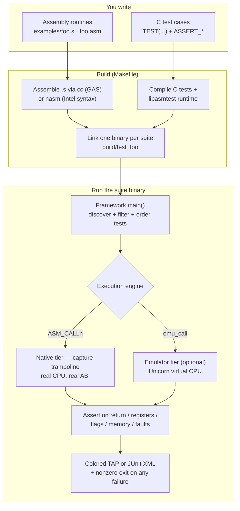

## Test lifecycle states

The states each test moves through in the runner — from [Writing tests](../getting-started/writing-tests.md).

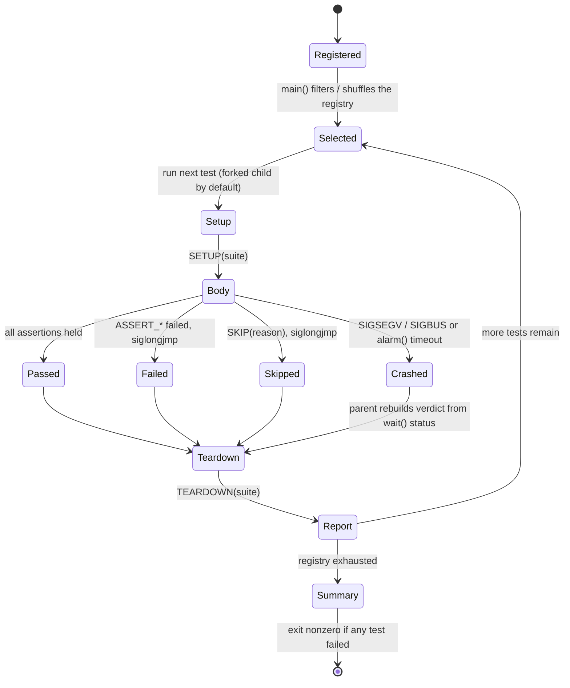

## Runner fork-per-test lifecycle

How the parent runner and each forked child exchange a verdict — from
[The test runner](../guides/runner.md).

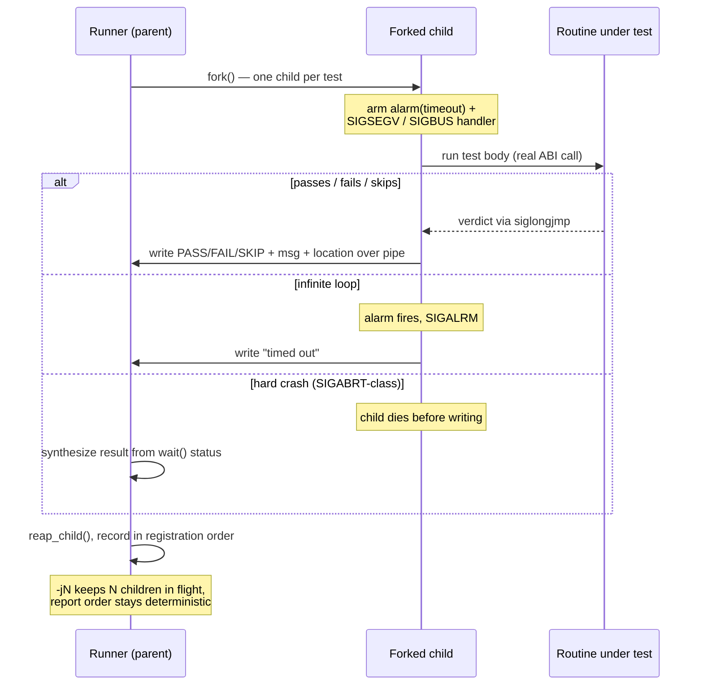

## Capture trampoline

How `ASM_CALLn` runs a routine through the real ABI and snapshots register state —
from [ABI capture & registers](../guides/abi-capture.md).

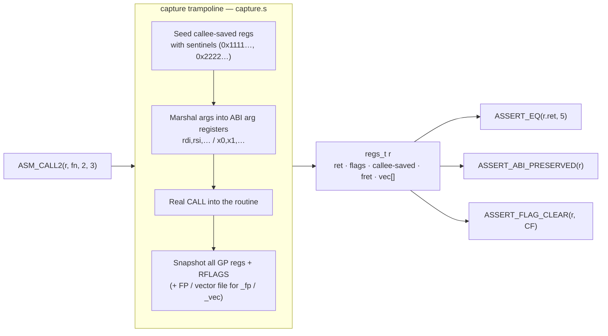

## Register snapshot layouts across ABIs

The `regs_t` shape under each calling convention — from
[ABI capture & registers](../guides/abi-capture.md).

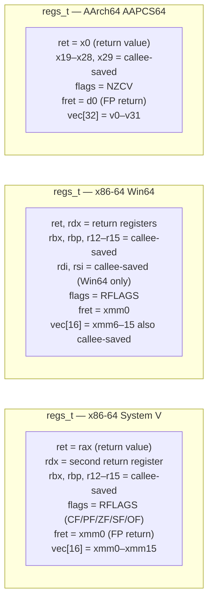

## Assertion families

The six families of `ASSERT_*` macros — from [Assertions](../guides/assertions.md).

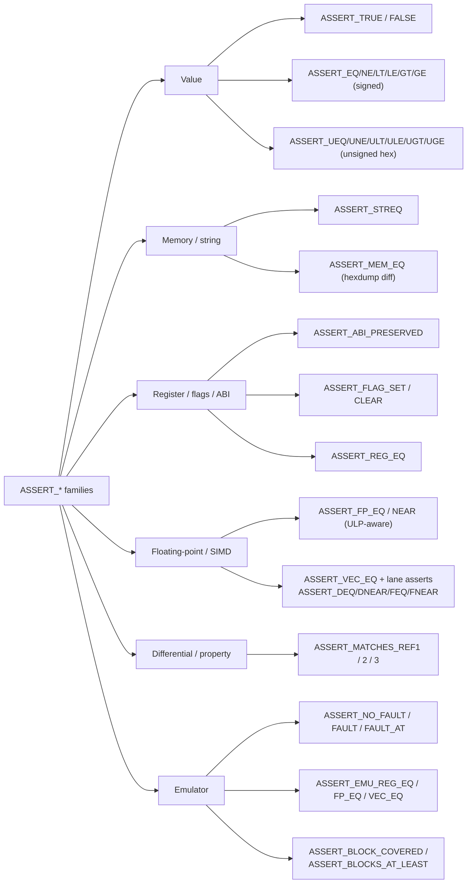

## Property and differential testing loop

The generate → call → compare-against-reference loop — from
[Property / differential testing](../guides/property-testing.md).

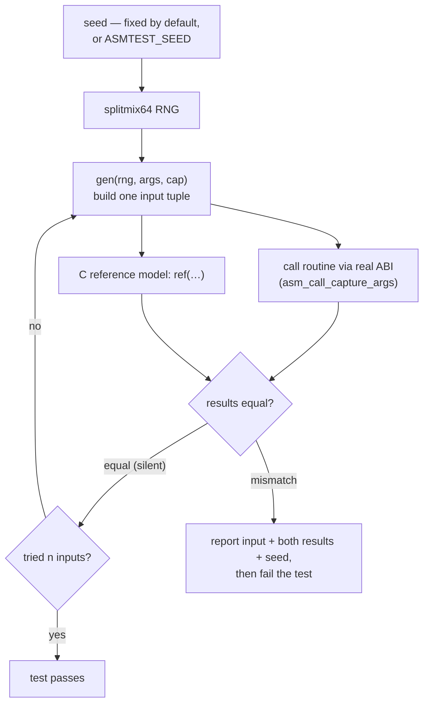

## Emulator guests

The five emulator guests and the shared `*_open` → `*_call` → result shape — from
[Emulator tier](../guides/emulator.md).

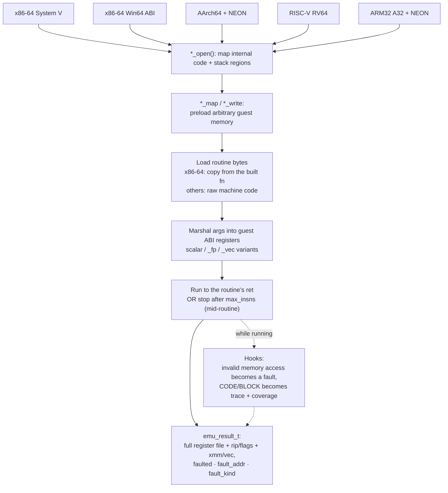

## Emulator trace and coverage flow

How `emu_call_traced` accumulates coverage and feeds the reporting/lcov helpers —
from [Emulator tier](../guides/emulator.md).

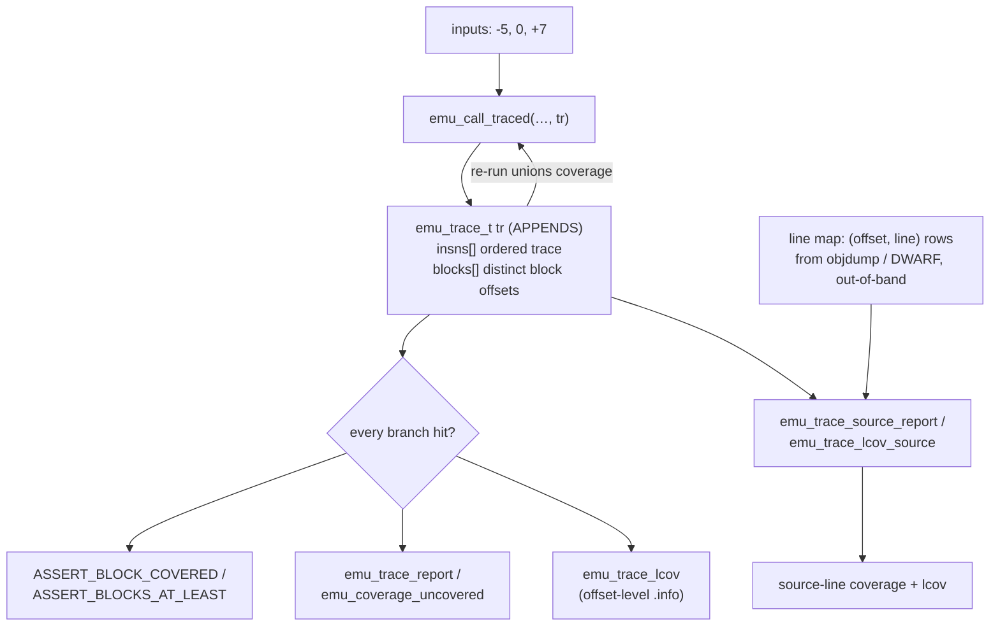

## Trace and coverage backends

Every trace backend — emulator, native DBI, and hardware — fills the **same**
`asmtest_trace_t` sink, so a test switches backends without changing how it reads
coverage — from [Native runtime tracing](../guides/tracing/native-tracing.md),
[Execution traces](../guides/tracing/traces.md), and
[Hardware tracing](../guides/tracing/hardware-tracing.md).

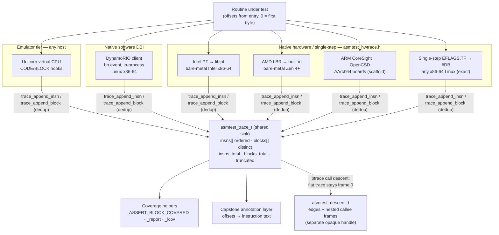

## Portability across targets

How one source set reaches every target natively and via the emulator guests — from
[Portability](portability.md).

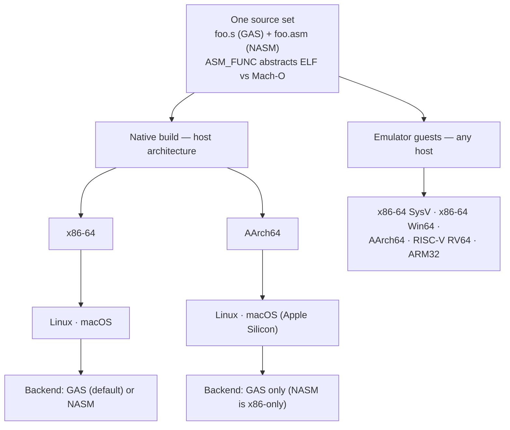

## Language bindings architecture

The C core, the flat binding ABI, and the per-language modules that reproduce a
shared conformance corpus — from [Language bindings](../bindings/index.md).

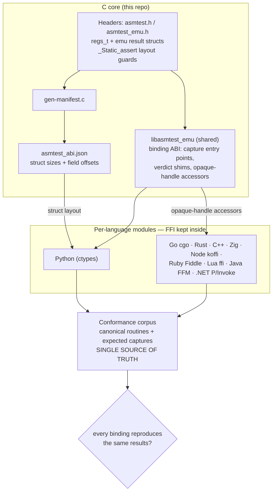
