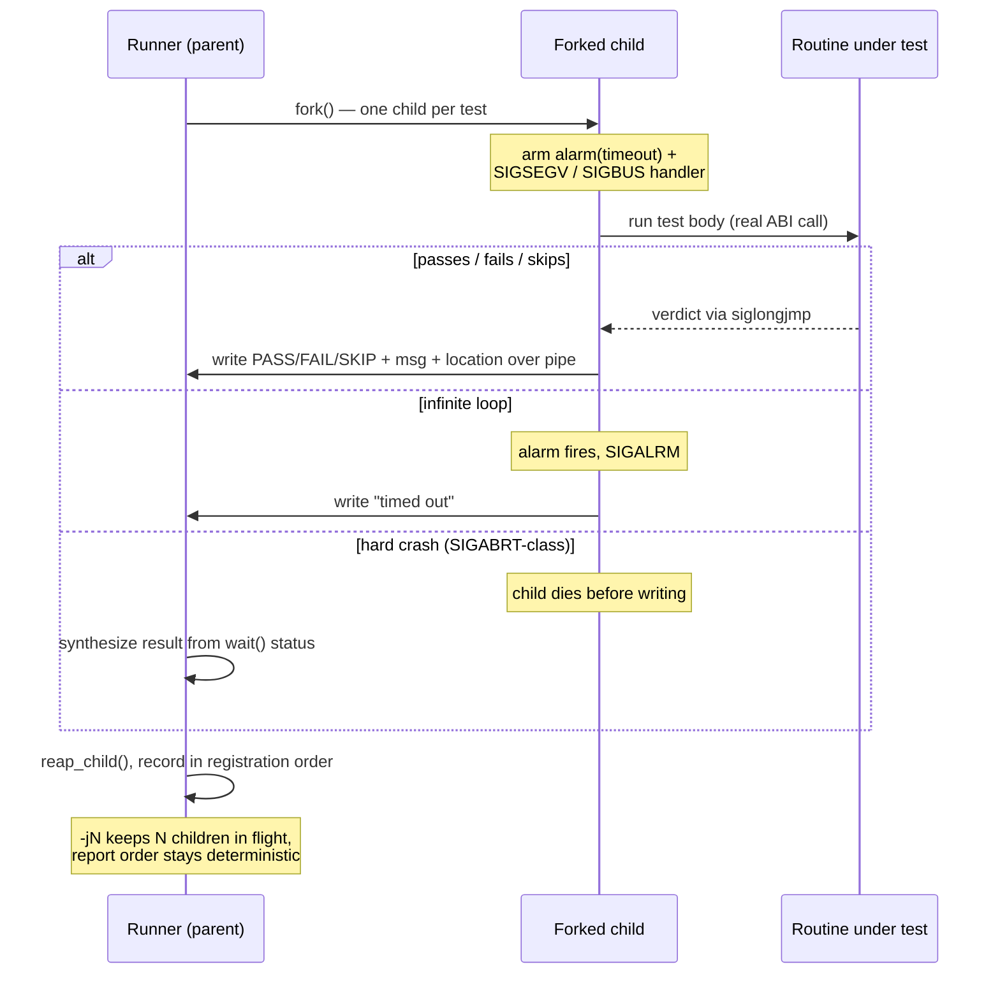

# The test runner

Each suite is a self-contained binary whose `main()` is provided by the
framework. It discovers the registered tests, runs them with isolation and
timeouts, and reports results. This page covers its command-line interface and
robustness model.

## Command-line interface

```sh
./build/test_arith                        # run every test, colored TAP output
./build/test_arith --list                 # list tests without running them
./build/test_arith --filter='*overflow*'  # run a glob-matched subset
./build/test_arith --shuffle --seed=123    # run in a reproducible random order
./build/test_arith --timeout=5             # per-test timeout in seconds (0 = off)
./build/test_arith --no-fork               # run in-process (no per-test isolation)
./build/test_arith -j4                     # run up to 4 tests at once (ordered)
./build/test_arith --format=junit          # JUnit XML instead of TAP, for CI
./build/test_bench --bench                 # time BENCH cases (see Benchmarks)
```

| Flag | Effect |
|---|---|
| `--list` | Print the test names and exit |
| `--filter=GLOB` | Run only tests whose `suite`, `name`, or `suite.name` matches the glob |
| `--shuffle` | Randomize test order (Fisher–Yates) to surface order dependencies |
| `--seed=N` | Seed for `--shuffle`; the chosen seed is printed for replay |
| `--timeout=SEC` | Per-test timeout (also `ASMTEST_TIMEOUT`); `0` disables it |
| `--no-fork` | Run tests in-process instead of one child per test |
| `-jN` | Run up to `N` tests concurrently (order preserved in the report) |
| `--format=tap\|junit` | Output format; TAP (colored) is the default |
| `--bench` | Run `BENCH` cases instead of tests — see [Benchmarks](benchmarks.md) |

## Isolation and robustness

By default **each test runs in its own `fork()`ed child** guarded by an
`alarm()` timeout. This is what lets the framework test deliberately hostile or
buggy code without falling over:

- An **infinite loop** hits the alarm and is reported as a timeout — the run
  continues with the next test.
- A **segfault / bus error** (`SIGSEGV`, `SIGBUS`, …) in the routine under test
  becomes a reported failure, not a dead runner.
- A **`SIGABRT`-class corruption** that kills the child before it can report is
  reconstructed by the parent from the `wait()` status
  (`killed by signal …` / `timed out … (killed)`).

The child ships its outcome (PASS/FAIL/SKIP plus message and location) back to
the parent over a pipe:



Run the demo to watch a hang and a crash get contained:

```sh
make demo-robust
```

### `--no-fork`

`--no-fork` runs tests in the same process. An in-process signal handler still
catches `SIGSEGV`/`SIGBUS` and still times out hangs via the same alarm, but a
`SIGABRT`-class crash takes the whole runner down — which is exactly why forking
is the default. Use `--no-fork` when you need a debugger to see the crash in the
test process, or in an environment without `fork()`.

### Parallelism

`-jN` runs up to `N` tests at once (each still in its own child). The report
preserves a stable order regardless of completion order, so output stays
deterministic.

## Guard-page buffers

For routines that write through pointers, the framework offers allocations backed
by `mmap` guard pages, so an out-of-bounds access **faults precisely** (and is
then caught and reported by the isolation layer above) instead of silently
corrupting memory:

- `asmtest_guarded_alloc(n)` / `asmtest_guarded_free(...)` — a trailing guard
  page, so a one-past-the-end write (`buf[n]`) faults.
- `asmtest_guarded_alloc_under(n)` / `asmtest_guarded_free_under(...)` — a
  leading guard page, so an underrun (`buf[-1]`) faults.

Combine these with [`ASSERT_MEM_EQ`](assertions.md#memory) to test both *what* a
routine writes and that it stays *in bounds*.

## Output formats

The default is **colored TAP** — human-readable and consumable by any TAP
harness. `--format=junit` emits suite-grouped JUnit XML for CI systems that
ingest it (Jenkins, GitLab, GitHub test reporters). See [CI & Docker](ci.md) for
how the project wires this into its own pipeline.
